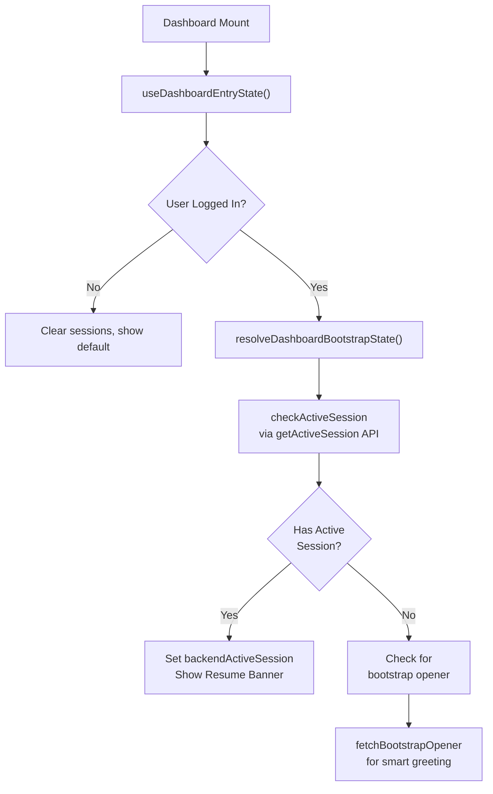

# Session History Flow - Complete Architecture

## Overview

Sophia implements a sophisticated multi-session management system with:
- **Two-tier session listing**: Open (active/paused) sessions + Ended (completed) sessions
- **Persistent state**: Zustand store with localStorage persistence
- **Dual bootstrap**: Backend state check + local cache fallback
- **Lazy message loading**: Messages loaded only when session is opened
- **Builder artifact integration**: Session artifacts can trigger builder tasks

---

## 1. How Previous Sessions Load on App/Dashboard Open

### A. Dashboard Bootstrap Flow (`useDashboardEntryState.ts`)

When the dashboard renders, it executes `resolveBootstrapState()`:



**Key Code Location**: [useDashboardEntryState.ts](frontend/src/app/components/dashboard/useDashboardEntryState.ts#L130)

```typescript
const state = await resolveDashboardBootstrapState({
  hasLocalActiveSession: Boolean(hasActiveSession && sessionSummary),
  hasRecentSessionEndHint: hasRecentEndHint,
  checkActiveSession: (force = false) => checkActiveSession(force, resolvedUserId),
  fetchBootstrapOpener,
});
```

### B. Session Store Initialization

On app mount, the session store hydrates from localStorage via Zustand's persist middleware:

**Persisted State** ([session-store.ts](frontend/src/app/stores/session-store.ts#L880)):
```typescript
partialize: (state) => ({
  session: state.session,           // Current active session
  openSessions: state.openSessions, // Open/paused sessions
  recentSessions: state.recentSessions, // Recently ended sessions
}),
```

### C. Session Sidebar Load (`RecentSessionsSidebar`)

When the sessions sidebar expands:

**Location**: [DashboardSidebar.tsx](frontend/src/app/components/dashboard/DashboardSidebar.tsx#L225)

```typescript
useEffect(() => {
  if (isExpanded) void refreshOpenSessions();
}, [isExpanded, refreshOpenSessions]);
```

This calls `refreshOpenSessions()` → `fetchOpenSessions(userId)` → **GET `/api/sessions/open`**

```typescript
refreshOpenSessions: async (userId) => {
  // Debounce: Don't fetch if recently fetched (< 15 seconds)
  const recentlyFetched = (
    lastOpenSessionsFetchAt !== null
    && lastOpenSessionsUserId === normalizedUserId
    && now - lastOpenSessionsFetchAt < 15000
  );
  
  if (recentlyFetched) return openSessions.length;
  
  const result = await fetchOpenSessions(normalizedUserId);
  if (result.success) {
    set({
      openSessions: result.data.sessions,
      lastOpenSessionsFetchAt: now,
      lastOpenSessionsUserId: normalizedUserId,
    });
  }
}
```

### D. Ended Sessions Load

Ended sessions come from `useSessionHistoryStore` (separate store), which loads from localStorage and can be synced from backend via session list API.

---

## 2. User Clicks Session from History/Sidebar

### Flow: Session Selection → Restoration → Navigation

**Location**: [RecentSessionsSidebar.tsx](frontend/src/app/components/dashboard/DashboardSidebar.tsx#L240)

```typescript
const rows = useMemo(() => {
  // For open sessions:
  list.push({
    onClick: () => {
      void restoreOpenSession(s, resolvedUserId)
        .catch(() => {}) // Silent catch - session page has recovery
        .finally(() => {
          router.push('/session');
        });
    },
    onDelete: () => {
      void removeOpenSession(s.session_id);
    },
  });
  
  // For ended sessions:
  list.push({
    onClick: () => { 
      viewEndedSession(s.sessionId, s.presetType, s.contextMode);
      router.push('/session');
    },
  });
}, [openSessions, endedSessions, restoreOpenSession, ...]);
```

### Step-by-step for Open Sessions:

**Step 1: Revalidate with Backend**
```typescript
restoreOpenSession: async (sessionInfo, userId) => {
  // Always fetch latest from backend to catch status changes
  const latestSession = await getSession(sessionInfo.session_id, resolvedUserId);
  
  // If session status changed to 'ended', use that. Otherwise use current list snapshot.
  if (!(incomingStatus !== 'ended' && latestStatus === 'ended')) {
    resolvedSessionInfo = latestSession.data;
  }
}
```

**Step 2: Update Session Store with Restored Session**
```typescript
const restored: SessionClientStore = {
  sessionId: resolvedSessionInfo.session_id,
  threadId: resolvedSessionInfo.thread_id,
  userId: resolvedUserId,
  presetType: resolvedSessionInfo.session_type,
  contextMode: resolvedSessionInfo.preset_context,
  status: mapBackendStatusToClient(resolvedStatus),
  voiceMode: resolvedSessionInfo.platform === 'voice',
  startedAt: resolvedSessionInfo.started_at,
  lastActivityAt: resolvedSessionInfo.updated_at,
  // ... etc
  isActive: resolvedIsInteractive,
};

set({
  session: restored,
  openSessions: resolvedIsInteractive ? upsertSessions(...) : filtered,
  recentSessions: upsertSessions(...),
  error: null,
});
```

**Step 3: Load Messages into Chat Store**
```typescript
try {
  const { useChatStore } = await import('./chat-store');
  await useChatStore.getState().loadSession(sessionId, userId);
} catch {
  logger.warn('Failed to restore messages...');
}
```

**Step 4: Navigate to Session Page**
```typescript
router.push('/session'); // Sidebar component calls this
```

---

## 3. Session Data Rehydration

### A. Session-Store Rehydration (synchronous)

Happens on app load via Zustand persist middleware:
```typescript
create<SessionState>()(
  persist(
    (set, get) => ({ ... }),
    {
      name: 'sophia-session-store',
      storage: createJSONStorage(() => localStorage),
      partialize: (state) => ({ ... }),
    }
  )
);
```

**Stored Keys in localStorage**:
- `sophia-session-store` (main)
  - `.session` (current session metadata)
  - `.openSessions` (list of open/paused sessions)
  - `.recentSessions` (recently ended sessions)

### B. Chat Messages Rehydration (asynchronous)

When `restoreOpenSession()` is called or session page loads:

**Location**: [chat-store.ts](frontend/src/app/stores/chat-store.ts#L330)

```typescript
loadSession: async (sessionId: string, userId?: string) => {
  set({ isLoadingHistory: true });
  
  try {
    // API Call: GET /api/sessions/{sessionId}/messages
    const result = await getSessionMessages(sessionId, userId);
    
    // Convert backend format → chat store format
    const restored: ChatMessage[] = result.data.messages.map((m) => ({
      id: m.id || createMessageId(),
      role: m.role === 'user' ? 'user' : 'sophia',
      content: m.content,
      createdAt: new Date(m.created_at).getTime(),
      status: 'complete',
      source: 'text',
    }));
    
    // Store in chat store
    set({
      messages: restored,
      conversationId: sessionId,
      isLoadingHistory: false,
    });
    
    // Also sync to session store for backup
    useSessionStore.getState().updateMessages(sessionMessages);
    
  } catch (err) {
    set({ isLoadingHistory: false, lastError: msg });
  }
}
```

### C. API Calls During Restoration

| API | Called By | When | Purpose |
|-----|-----------|------|---------|
| `GET /api/sessions/active` | `checkActiveSession()` | Dashboard mount | Detect active session on backend |
| `GET /api/sessions/open` | `refreshOpenSessions()` | Sidebar expand | List all open/paused sessions |
| `GET /api/sessions/{id}` | `restoreOpenSession()` | Before session restore | Revalidate latest status |
| `GET /api/sessions/{id}/messages` | `loadSession()` | Session page load | Load all conversation history |
| `GET /api/bootstrap/opener` | `fetchBootstrapOpener()` | Dashboard mount | Smart greeting generator |

### D. Local Storage vs Backend Resolution

**Priority Order for Session State**:
```
1. Backend `/sessions/active` (most authoritative for current session)
2. Session store openSessions (cached list)
3. Session store recentSessions (fallback)
4. Session store.session (last known local state)
```

---

## 4. Builder Task Flow Integration with Session History

### A. Builder Artifact Storage

When Sophia emits a builder artifact during a companion turn, it's stored:

**Location**: [session-store.ts](frontend/src/app/stores/session-store.ts#L816)

```typescript
storeBuilderArtifact: (builderArtifact) => {
  const { session } = get();
  if (!session) return;
  
  set({
    session: {
      ...session,
      ...(builderArtifact ? { builderArtifact } : { builderArtifact: undefined }),
      lastActivityAt: new Date().toISOString(),
    },
  });
}
```

This persists to localStorage as part of `session` object.

### B. Session Restoration + Builder Context

When reopening a session with a stored builder artifact:

**Location**: [session/page.tsx](frontend/src/app/session/page.tsx#L49)

The session page reads:
```typescript
const builderArtifact = useSessionStore(selectBuilderArtifact);
```

And displays the `BuilderTaskNotice` component if artifact exists:

**Location**: [BuilderTaskNotice.tsx](frontend/src/app/components/session/BuilderTaskNotice.tsx)

```typescript
// Shows a pill/card if session has a builder task from earlier
if (builderArtifact) {
  return (
    <BuilderTaskNotice
      artifact={builderArtifact}
      onStartTask={() => {
        // Triggers builder invocation via companion stream
      }}
    />
  );
}
```

### C. No Automatic Builder Restart on Session Resume

**Key Behavior**: 
- Builder artifacts are **displayed** when session reopens
- They are **not automatically re-executed**
- User must manually click "Start Task" if they want to continue
- This prevents runaway builder invocations on session restore

---

## 5. Key Files and Responsibilities

### State Management
| File | Purpose |
|------|---------|
| [session-store.ts](frontend/src/app/stores/session-store.ts) | **Primary store** for session metadata + open/recent lists. Persisted to localStorage. |
| [chat-store.ts](frontend/src/app/stores/chat-store.ts) | Chat messages, composer state, stream lifecycle. Also persisted. |
| [session-history-store.ts](frontend/src/app/stores/session-history-store.ts) | Ended sessions, recap view state. Separate from open sessions. |

### Components
| File | Purpose |
|------|---------|
| [RecentSessionsSidebar](frontend/src/app/components/dashboard/DashboardSidebar.tsx#L205) | Expands from nav rail to show sessions. Handles clicks → restoreOpenSession. |
| [EnhancedFieldDashboard](frontend/src/app/components/EnhancedFieldDashboard.tsx) | Dashboard root. Initializes refreshOpenSessions on mount. |
| [useDashboardEntryState](frontend/src/app/components/dashboard/useDashboardEntryState.ts) | Hook that orchestrates bootstrap (active session check + opener fetch). |

### Hooks
| File | Purpose |
|------|---------|
| [useSessionPersistence.ts](frontend/src/app/hooks/useSessionPersistence.ts) | Restores persisted session on route load. Called by session page. |
| [useSessionStart.ts](frontend/src/app/hooks/useSessionStart.ts) | Handles session creation + API integration. Has `checkActiveSession()`. |
| [useSessionBootstrap.ts](frontend/src/app/hooks/useSessionBootstrap.ts) | Session page mount: restores route state, primes chat. |

### APIs
| File | Purpose |
|------|---------|
| [sessions-api.ts](frontend/src/app/lib/api/sessions-api.ts) | Client for `/api/sessions/*` endpoints. Core API wrapper. |
| [bootstrap-api.ts](frontend/src/app/lib/api/bootstrap-api.ts) | `GET /api/bootstrap/opener` — generates smart greetings. |

---

## 6. Sequence Diagram: Opening Historical Session

```
User Clicks Session in Sidebar
        ↓
RecentSessionsSidebar.onClick()
        ↓
restoreOpenSession(sessionInfo, userId)
        ├─ API: GET /api/sessions/{id}  [Revalidate status]
        ├─ Update: session-store.session = restored
        ├─ Update: session-store.openSessions (upsert)
        └─ Chat Load:
           └─ API: GET /api/sessions/{id}/messages
              ├─ Store: chat-store.messages = [...messages]
              └─ Store: session-store.updateMessages()
        ↓
router.push('/session')
        ↓
Session Page Mounts
        ├─ useSessionBootstrap() [restore persistence]
        ├─ useSessionInfrastructure() [bind chat runtime]
        └─ Display messages from chat-store.messages
```

---

## 7. Potential Issues & Edge Cases

### Issue 1: Stale Session Status on Resume
**Problem**: List shows session as "open", but backend has already marked it "ended".

**Mitigation**: `restoreOpenSession()` calls `getSession()` before restoring:
```typescript
const latestSession = await getSession(sessionInfo.session_id, resolvedUserId);
// Only use new status if transition is valid (e.g., open→ended OK, ended→open rejected)
if (!(incomingStatus !== 'ended' && latestStatus === 'ended')) {
  resolvedSessionInfo = latestSession.data;
}
```

### Issue 2: Messages Don't Load (Chat Empty on Session Open)
**Problem**: `loadSession()` fails silently, user sees empty message history.

**Current Behavior**: Error logged but page doesn't block. Session page has recovery logic in `useSessionBootstrap()`.

**File**: [useSessionBootstrap.ts](frontend/src/app/hooks/useSessionBootstrap.ts) — contains retry logic.

### Issue 3: Builder Artifact Lost on Refresh
**Problem**: Builder artifact stored in session-store, but if session-store localStorage is cleared...

**Mitigation**: None currently. Artifact is only in RAM + localStorage. If both cleared, it's lost. Not critical since artifact is also in backend context.

### Issue 4: Open Sessions Fetch Debounce (15s cache)
**Problem**: If user deletes a session in another tab, local cache doesn't update immediately.

**Mitigation**: 15-second TTL on `lastOpenSessionsFetchAt`. Force refresh by calling `refreshOpenSessions()` again.

**Code**: [session-store.ts](frontend/src/app/stores/session-store.ts#L170)
```typescript
const recentlyFetched = (
  lastOpenSessionsFetchAt !== null
  && lastOpenSessionsUserId === normalizedUserId
  && now - lastOpenSessionsFetchAt < 15000  // 15 second debounce
);
```

### Issue 5: Builder Task Notice Appears but Builder Not Ready
**Problem**: User opens historical session with builder artifact, clicks "Start Task", but builder isn't initialized.

**Mitigation**: `BuilderTaskNotice` checks `isBuilderReady` before allowing click. Falls back gracefully.

---

## 8. Resume Banner vs Session Sidebar

### Resume Banner (`ResumeBanner.tsx`)
- **When shown**: Dashboard detects active/resumable session
- **Data source**: `backendActiveSession` from `checkActiveSession()` API
- **Actions**: Continue → navigate to `/session` and restore
- **Dismissible**: Yes, with "Start Fresh" option

### Recent Sessions Sidebar
- **When shown**: User opens nav rail → clicks "Sessions"
- **Data source**: `openSessions` from `refreshOpenSessions()` API
- **Actions**: Click session → restore → navigate
- **Special**: Shows both open AND ended sessions

**Difference**: Banner is for current/urgent resume; Sidebar is historical browse.

---

## 9. Flow Diagram: Complete Session Lifecycle

```
App Launch
  ↓
├─ [1] Bootstrap Check
│  └─ getActiveSession() → backendActiveSession
│
├─ [2] Session Store Hydrate
│  └─ localStorage → openSessions, recentSessions, session
│
├─ [3] Show Resume Banner?
│  └─ if (backendActiveSession OR sessionSummary) → ResumeBanner
│
├─ [4] Optional: Fetch Bootstrap Opener
│  └─ getBootstrapOpener() → smart greeting
│
└─ Dashboard Displayed

User Click "Continue Session"
  ↓
restoreOpenSession()
  ├─ Revalidate: getSession(id) → latest status
  ├─ Update: session-store.session = restored
  ├─ Load Messages: getSessionMessages(id)
  ├─ Update: chat-store.messages = [...]
  └─ Navigate: /session

Session Page Open
  ↓
useSessionBootstrap()
  ├─ restorePersistedActiveSession() [load from cache]
  ├─ Bind chat runtime
  └─ Ready for interaction

During Session
  ↓
On Each Turn
  ├─ Send message
  ├─ Stream response
  ├─ recordOpenSessionActivity() [update preview + timestamp]
  └─ Store builder artifact (if emitted)

Session End
  ↓
endSession()
  ├─ Move from openSessions → recentSessions
  ├─ Offer debrief
  └─ Show recap (optional)
```

---

## 10. Summary: Key Takeaways

1. **Two-tier Architecture**: Open sessions (active) + Ended sessions (history)
2. **Persistent State**: Zustand + localStorage for fast reload
3. **Always Revalidate**: Before restoring, check backend status
4. **Lazy Load Messages**: Only load on session open, not on list fetch
5. **Builder Integration**: Artifacts stored in session, displayed but not auto-executed on restore
6. **Bootstrap Flow**: Active session check → Opener fetch → Resume banner
7. **No Critical Issues**: Stale status mitigated, message load failures degrade gracefully

