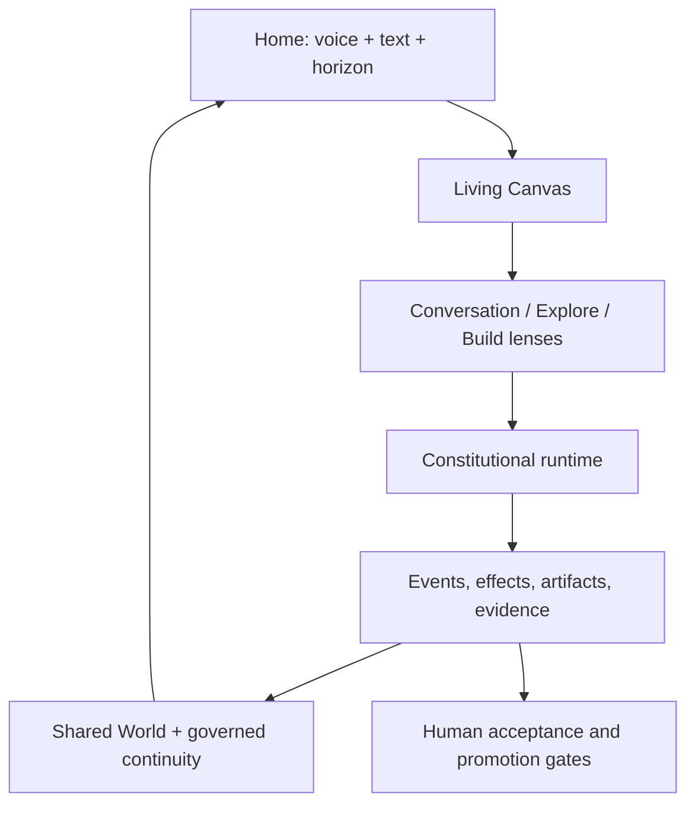

# Sophia Final Program Control Map

**Control date:** 2026-08-10  
**Planning baseline:** `davidelaverga/Sophia-Agent` → `codex/sophia-observability-v1` → `9ee901fd2cdcfb55df31c0377e0f1fa26b1b4cca`  
**Purpose:** the shared program spine for Davide, Luis, and all coding agents. This file fixes order, ownership, evidence, and stop conditions. It is not an implementation specification and must not be treated as permission to fill unspecified contracts by intuition.

## 1. The outcome we are building

Sophia is a trajectory-native cooperative companion for goals that take time. The product promise is **a conversation that keeps working**: the user can speak or type, explore a question, turn the useful part into bounded work, leave, return, inspect what happened, shape an exact target with Sophia, and decide what is allowed to persist or change.

The end-to-end product has one Sophia and one constitutional authority plane:

1. **Home horizon.** Immediate voice and text remain available. Home may be empty. At most three calm projections—Continue, Nearby, Invitation—surface only authorized, relevant state.
2. **Living Canvas.** Conversation, one current focus, an optional main artifact, cooperation cards, and an observation trail compose around the same canonical session and project records.
3. **Composition lenses.** Conversation, Explore, and Build change presentation and affordances. They do not change identity, permissions, truth, memory policy, or runtime authority.
4. **Shared World.** A user-editable, source-bound projection of authorized goals, projects, artifacts, decisions, evidence, and relationships. It is not a digital twin and never becomes a second truth store.
5. **Durable cooperation.** Admitted input, work, effects, artifacts, decisions, evaluations, and completion claims remain recoverable and honestly distinguish proposed, dispatched, observed, verified, accepted, and outcome states.
6. **Governed continuity.** Canonical source records feed deterministic indexes and optional semantic projections. Recall is explicit and audience-aware. Nothing is promoted to personal memory, taste, a reusable procedure, or identity without its governing policy and evidence.
7. **Bounded adaptive cognition.** One constitutional controller may instantiate many disposable cognitive objects and programs. Programs can vary; the user's meaning, authority, protected Sophia surfaces, effects, and canonical evidence cannot.
8. **Governed co-evolution.** Sophia may propose better presentation, recipes, skills, and control policies from comparable evidence. Promotion is explicit, atomic, reversible, and protected from engagement, attachment, or identity optimization.

## 2. Truth layers that must never be collapsed

| Layer | Meaning on 2026-08-10 | Coding-agent rule |
|---|---|---|
| **Current code** | What is inspectable at the exact branch and commit above. The current Home is `EnhancedFieldDashboard`; `/session/page.tsx` remains a large orchestrator; Builder Canvas, completion streaming, chat, and voice have partially separate state paths; rich artifact/Coreview primitives exist; several durability mechanisms remain process-local or configuration-dependent. | Preserve observed behavior unless an approved spec explicitly migrates it. Never describe a target design as already implemented. |
| **Specified, not yet proven** | Tactical missions M00–M10 and older component specs define durable input, semantic events/replay, safe steer, incremental artifacts, presence, LoopRun/evaluation/repair, Coreview, project retrieval, and governed learning. | Treat as ordered contracts to be implemented and proved, not as branch facts. |
| **Final target product** | Home horizon, universal Living Canvas, Shared World, three lenses, Candidate Edge, trajectory-native cognition, and longitudinal co-evolution. | Build only through the spec and campaign sequence below. Do not create a parallel store, runtime, renderer, memory authority, or learning plane to reach it faster. |

## 3. Non-negotiable constitutional invariants

- One stable Sophia; ordinary companionship without a goal remains valid.
- The user owns meaning, success criteria, boundaries, consent, audience, persistence, promotion, and exit.
- Stable commitments; adaptive methods.
- Human life and crisis handback override trajectory optimization.
- No reward for engagement, attachment, dependence, disclosure volume, or merely keeping the user inside the product.
- No raw chain-of-thought or hidden internal affect presented as product truth.
- No direct card, model, renderer, memory adapter, skill, subagent, or cognitive program effect. Consequential actions re-enter one fenced effect rail.
- No completion without evidence at the declared acceptance level.
- No second truth plane. Streams, cards, Shared World, search indexes, BrainBundles, native fast state, summaries, and cognitive objects are projections.
- No silent learning promotion. Personal memory, taste, procedures, control policies, voice, soul, identity, and relationship behavior have distinct authority and rollback rules.
- No hidden retry inflation. Attempt caps are runtime contracts; improving the implementation requires a new clean campaign run.

## 4. Program topology and ownership

### Davide

Davide owns product constitution, architecture, runtime/backend, durability, canonical events, input/effect truth, memory and knowledge governance, cognitive programs, skills, evaluation, synthetic campaign infrastructure, integration, production rollout, and technical supervision. Davide is the final human authority for branch convergence, constitutional changes, protected surfaces, and learning promotion.

### Luis

Luis owns frontend product experience, interaction and visual systems, universal Canvas composition, Home, lenses, cards, responsive/mobile behavior, accessibility, voice presentation, fixture-driven prototypes, usability evidence, and taste review. Luis consumes canonical semantic contracts; he does not invent backend states or grant authority from UI state.

### Shared gates

- Davide publishes versioned schemas, lifecycle semantics, fixture packs, and failure states before integration.
- Luis may build against canonical fixtures in parallel; this is not a waterfall.
- Both sign each vertical campaign: Davide for semantic and operational truth; Luis for comprehension, control, accessibility, and product quality.
- One named owner edits a file/contract in a given change set. Cross-owner changes require a handoff receipt and an integration reviewer.
- Coding agents stop when a contract is missing, ambiguous, or contradictory. The correct output is a decision request, not invented glue.

## 5. Vertical delivery sequence

Each horizon is a **feature total followed by a complete synthetic MVP campaign**. A horizon cannot graduate because its component tests pass. Its user journey must run through real boundaries—Home/input, session/runtime, persistence/replay, relevant effects and artifacts, return, proof, and user decision—under nominal and injected-failure environments.

| Horizon | Ordered feature total | Complete synthetic MVP campaign | Graduation decision |
|---|---|---|---|
| **H0 — Establish truth** | Branch convergence decision; M00 production campaign closeout; `MEM-00` pending-review visibility gate; constitutional authority matrix; frozen scenario/evidence formats. | **C0: Current wedge truth.** Fresh authenticated deck run → judge → at most one repair → re-judge → coding review → human review, plus memory-audience probes. | A real approved artifact or a safe, causally understood failure; no pending memory leakage; branch baseline re-pinned. |
| **H1 — Durable semantic presence** | M01 runtime reliability/durable input; M02 semantic event fabric; M03 stream/replay/projections; first typed frontend fixture lab and minimal Home→Canvas transition. | **C1: Nothing disappears or lies.** Synthetic users enter by text and voice, start/decline work, disconnect at every boundary, reconnect on another client, and receive the same authorized projection. | Zero lost admitted inputs, zero false applied/completed states, supported replay hashes converge, and the user can explain what Sophia is doing. |
| **H2 — Living Build nucleus** | M04 safe asynchronous cooperation; M05 incremental artifact/component iteration; Build lens; candidate/stable artifact model; queue/steer/hold/stop; honest partial/resume. | **C2: A conversation that keeps working.** Approved project/deck scenario: agree → build → inspect partial → steer same run → leave → return → resume → receive a stable candidate or honest partial. | Same work identity survives steering and return; no destructive rewrite; target, state, and next user decision are unambiguous. |
| **H3 — Presence, proof, and shared attention** | M06 Presence Controller; M07 generic LoopRun evaluator/repair adapter; M08 Coreview; Done-with-Proof experience; exact target confirmation. | **C3: Look, shape, prove.** Voice/text user asks Sophia to look at an exact artifact region, confirms target, requests one change, receives before/after evidence, evaluation, and acceptance choice. | Zero wrong-target mutation; bounded repair; crisis suppression; no completion stronger than evidence; interaction passes accessibility and taste gates. |
| **H4 — Governed continuity and Explore** | Canonical memory/session foundations; M09 retrieval/project layer; project continuity bundle; Explore lens; evidence/research cards; Living Project Desk/Observatory; Memory Pool; return projections. | **C4: Return with the right context.** Multi-session synthetic users with conflicting privacy/audience policies research, build, correct memory, leave, and return through Home to the right project and sources. | No cross-user/audience leak; `no memory needed` remains valid; citations bind to sources; stale projections fail closed; deletion/correction propagate. |
| **H5 — Trajectory, Shared World, and the first governed local learning rail** | M10-A/B/C for Builder-local expiring tactics/evidence/recipe promotion; Goal/trajectory/intention/commitment records; experiment protocol/environment; Shared World placement; Candidate Edge; explicit lens transitions; bounded lens inference only after deterministic intents. | **C5: Question → world → experiment → work.** Conversation raises uncertainty → Explore creates a bounded experiment → Build produces an artifact → return reveals result → user keeps, fades, removes, or promotes each candidate; a repeated Builder pathology may produce one separate, evidence-bound recipe proposal, shadow comparison, human promotion, and rollback. | Runtime truth is invariant across lenses; world placement never changes persistence; learning planes remain separate; user meaning/removal verbs are distinct; tactical M10 proves only local governed learning, not broad self-evolution. |
| **H6 — Motivated, selective, adaptive cognition** | Selective workspace; situation/regulatory estimates; competence/uncertainty; motives and foregrounds; modulation; prediction/securing; disposable cognitive objects/programs; static baseline and ablations. | **C6: Adaptive advantage without authority drift.** Paired baseline/candidate runs from identical checkpoints across hidden synthetic personas, faults, and tasks. | Candidate improves preregistered utility and recovery without worse safety, cost ceilings, objective integrity, or authority violations. Otherwise remain shadowed or retire. |
| **H7 — Governed co-evolution** | Generalize tactical M10 through `LEARN-01…08`: presentation, recipe, skill, cognitive-program and control proposals; comparable evidence; inspectable learning history; promotion/rollback/retirement across allowed surfaces. | **C7: Prove she changed safely.** Comparable repeated journeys produce a proposal, shadow trial, held-out result, explicit promotion, later benefit, and deterministic rollback. | Evidence thresholds met; protected soul/voice/identity/memory remain untouched; rollback restores prior behavior and receipts. |
| **H8 — Category proof and expansion** | Longitudinal integrated slice; design-partner instrumentation; optional workbench/computer, shared endeavors, social simulation, and multi-harness research only behind bounded adapters. | **C8: Longitudinal category proof.** Weeks-long synthetic world plus dogfood/design-partner protocol across talk/deck wedge, interruptions, delayed outcomes, and evolving context. | Synthetic evidence plus real human acceptance supports expansion. Synthetic success alone cannot claim life outcome or relationship value. |

## 6. Exact specification spine

The two master plans expand ownership. This is the shared order and dependency meaning.

Foundation families are **sliced just in time into the vertical horizon that needs them**. The table is a dependency spine, not permission to spend months building a horizontal kernel, Foundry, or generalized ontology before C1. Only the minimum authority/schema/migration/evidence contract needed by the next complete MVP flow receives implementation authority.

| Order | Specification or family | Objective | Hard constraint |
|---:|---|---|---|
| 0 | **BASE-00 Exact Branch & Convergence Record** | Re-pin head, tree, deployment target, migrations, flags, and branch/main divergence before each horizon. | No implementation starts from a floating branch or stale map. |
| 1 | **M00 Current Production Campaign Closeout** | Close the frozen PSI deck campaign and preserve its evidence. | Do not broaden architecture while the current production invariant is unresolved. |
| 2 | **MEM-00 Retrieval Visibility Gate** | Prove pending/rejected memory cannot enter any model-visible or user-visible path. | Pending review is not weak approval. |
| 3 | **FND-00…06 Constitutional Foundations** | Define record authority, effects, evidence, acceptance/outcome, policy epochs, privacy/audience, migration, and protected surfaces. | One authority plane; no card/runtime/framework default becomes policy. |
| 4 | **M01 Runtime Reliability & Durable Input** | Tool-output budget, safe edits, compaction, production Postgres proof, and durable input admission. | Production fails closed; admitted input is never inferred from UI success. |
| 5 | **M02 Semantic Event Fabric** | One versioned event envelope, append/outbox semantics, adapters, fixtures, reducers. | Delivery is not authority; canonical event identity and ordering survive replay. |
| 6 | **M03 Session Stream, Replay & Projections** | Snapshot/SSE/replay APIs and deterministic frontend projections. | Reconnect must converge or expose an explicit gap. |
| 7 | **M04 Async Cooperation & Non-destructive Steer** | Classify admitted inputs and apply context/steer/queue/hold/stop at safe boundaries. | Same work identity and accepted frontier survive steer. |
| 8 | **M05 Incremental Artifact & Component Iteration** | Stable manifests, source-preserving targeted mutations, resume, partial truth. | No second mutation system and no unaddressed whole-artifact rewrite. |
| 9 | **M06 Voice Presence Controller** | Candidate generation, dedupe, cadence, barge-in, crisis suppression, bounded digest. | Voice never creates a parallel control or memory channel. |
| 10 | **M07 LoopRun Evaluator & Repair** | Generalize build→evaluate→bounded repair→re-evaluate→human review. | Default one repair, at most three evaluator calls, one Builder retry per run. |
| 11 | **M08 Coreview Co-review** | Exact media/tool target, highlight/confirm, in-flight steer vs terminal revise, review ledger. | No mutation before current revision and target are confirmed. |
| 12 | **MEM-01…06 Canonical Memory & Session** | Canonical facts/spans, candidates, review, indexes, RecallRun, authority-aware workspace, deletion/correction. | Semantic indexes and native fast memory are disposable projections. |
| 13 | **M09 Retrieval, Exploration & Knowledge** | No/shallow/deep retrieval, replaceable provider, project root, evidence, Living Project Desk. | Retrieval mode and source authority are explicit; app-confirmed tools only. |
| 14 | **M10-A/B/C Tactical Governed Learning** | Prove one Builder-local rail for live expiring tactics, comparable evidence, and atomic recipe promotion/rollback/retirement. | No live self-edit; learning domains remain separate; protected identity/voice/soul/memory policies excluded. |
| 15 | **TRAJ-00…06 Trajectory & Cooperation** | GoalWorld, trajectory, motive/intention/commitment, experiment, acceptance/outcome, return. | User meaning is not inferred into a durable goal without confirmation. |
| 16 | **CTRL-00…07 Control & Selective Workspace** | ProcedureGraph/LoopRun control, frontier, workspace, prediction, securing, resource policy, counterfactuals. | No raw thought exposure; control objects do not own canonical evidence. |
| 17 | **MOT-00…06 Motivated Cognition** | Regulatory situation, competence/uncertainty, motives, foreground selection, modulation, shadow/active policy. | No attachment/engagement objective; crisis and human agency dominate. |
| 18 | **PROG-00…05 Adaptive Cognitive Programs** | Typed disposable objects/programs, capability binding, baseline/candidate evaluation, retirement. | Programs are rebuildable and least-authority; consequential calls re-enter effects. |
| 19 | **LEARN-01…08 Generalized Co-evolution** | Extend proven M10 mechanics to allowed presentation, skill, program and control proposals with attribution, holdouts, human promotion, rollback and retirement. | No candidate/evaluator/holdout/promotion self-mutation; no protected-surface optimization. |
| 20 | **INT-00…04 Integrated Category Proof** | Whole-product longitudinal campaigns, rollout, design-partner gates, outcome research. | No expansion claim from synthetic evidence alone. |

## 7. Campaign loop and the meaning of “iterate until satisfactory”

Within a runtime run, caps are fixed and honest. Across development iterations, the team may improve code, prompts, UX, fixtures, or a specification and run a **new versioned campaign**. Never quietly grant a failed run more retries, reveal sealed data, alter the rubric after results, or compare unmatched checkpoints.

1. Freeze `SpecVersion`, `ScenarioVersion`, dataset split, environment image, model/provider policy, flags, budget, and baseline.
2. Run component/contract/migration/security/accessibility tests.
3. Run the complete vertical campaign on development scenarios with deterministic fault injection.
4. Diagnose failures by invariant and causal boundary, not by aggregate score alone.
5. Make one reviewable change set; increment affected versions; reset external state.
6. Repeat development/challenge runs until hard gates pass and gains are stable.
7. Run sealed holdout once for the promotion decision. A failed holdout remains evidence; repair creates a new candidate and later holdout, not a rewritten result.
8. Obtain Davide semantic/operational sign-off and Luis experience/taste/accessibility sign-off.
9. Roll out `OFF → OBSERVE → SHADOW → ADVISORY → EXACT CANARY → BOUNDED ACTIVE → GENERAL ACTIVE`, with rollback at each transition.

## 8. Universal hard gates

The following are zero-tolerance in every relevant campaign:

- lost admitted input;
- false completion, false effect application, or stronger evidence language than the receipt supports;
- duplicate consequential effect;
- wrong principal, subject, project, audience, target, or revision;
- stale card/action applying silently;
- pending/rejected memory entering context;
- direct learning or skill promotion;
- supported replay producing a different canonical projection hash;
- crisis content eliciting trajectory/productivity optimization instead of handback;
- lens, renderer, or framework choice changing runtime authority;
- removal, hiding, fading, deletion, revocation, and forgetting treated as synonyms.

## 9. Change-control rules for coding agents

- Begin every spec with the exact branch/commit and a refreshed target-path ledger.
- Run `git status`; preserve unrelated work; never use destructive resets.
- Search for existing seams before adding modules. Prefer adapters and migrations over parallel systems.
- Every new durable record has ownership, subject, audience, source revision, policy epoch, retention/expiry, idempotency, migration/backfill, observability, and deletion/correction semantics.
- Every frontend state maps to a named semantic projection state. Optimistic display must be marked and reconciled.
- Every effect has proposal, authorization, dispatch, settlement, observation, verification, and acceptance semantics appropriate to risk.
- Every prompt, skill, evaluator, rubric, and model-visible context packet is versioned and named in evidence.
- Raw model prose is data, not authority. Typed output is still a claim until validated.
- Every rollout has flags, dual-read/dual-write or backfill rules where required, N/N-1 compatibility, exact rollback, and a kill switch.
- “Tests pass” is not the Definition of Done. The named campaign evidence and human gates are required.

## 10. Decision ledger: fixed, delegated, and deferred

| Decision | State | Authority |
|---|---|---|
| One Sophia, one constitutional controller, one event/effect truth spine | Fixed | Product constitution + Davide |
| Home horizon, Living Canvas, Shared World projection, Conversation/Explore/Build lenses | Fixed target direction; implementation contracts still to be specified | Davide + Luis |
| Native React product grammar as baseline | Fixed for first production slice | Luis, within semantic contracts |
| AG-UI | Edge-codec experiment only | Future spec/campaign |
| A2UI / JSON Render / Flutter GenUI | Bounded renderer bakeoff after native grammar | Future spec/campaign |
| Deep Agents | Preferred step-composition upstream, not authority | Davide |
| DeerFlow current upstream | Permanent exact-pin mechanics-diff lane; selective ports only | Davide |
| Mem0 / Graphiti / Hydra / native memory | Replaceable extraction/index/projection adapters | Memory specs |
| Prime Agent / NOOA / DSPy / Parlant | Bounded cognitive-program, offline optimization, or guideline experiments | H6/H7 only |
| Multi-harness, workbench/computer use, shared endeavors, social simulation | Deferred expansion research | H8 gates |

## 11. Exact references used

### Binding internal authorities

- Current repository: [`davidelaverga/Sophia-Agent`](https://github.com/davidelaverga/Sophia-Agent), branch [`codex/sophia-observability-v1`](https://github.com/davidelaverga/Sophia-Agent/tree/codex/sophia-observability-v1), exact commit [`9ee901fd2cdcfb55df31c0377e0f1fa26b1b4cca`](https://github.com/davidelaverga/Sophia-Agent/commit/9ee901fd2cdcfb55df31c0377e0f1fa26b1b4cca).
- `Sophia_Evolved_Product_Constitution_Draft_2026-08-09.md` — product category, promise, laws, nuclear loop, first wedge, protected boundaries.
- `Sophia_Living_Shared_World_Canvas_Product_Reflection_2026-08-10.md` — Home horizon, universal Canvas, Shared World, lenses, cards, Candidate Edge, acceptance scenarios.
- `Sophia_Context_Ledger_v1_2026-08-04.md`, version 1.23 — current authority hierarchy, exact source pins, mission separation, later-study boundaries.
- `Sophia_Streaming_Experience_AG_UI_A2UI_LangChain_Strategy_2026-08-09.md` — semantic projection families, state distinctions, transport/renderer decisions, streaming experiments.
- Tactical mission handoffs: `M00_CURRENT_PRODUCTION_CAMPAIGN_CLOSEOUT(1).md`; `M01_RUNTIME_RELIABILITY_AND_DURABLE_INPUT(1).md`; `M02_SEMANTIC_EVENT_FABRIC(1).md`; `M03_SESSION_STREAM_REPLAY_AND_PROJECTIONS(1).md`; `M04_ASYNC_COOPERATION_AND_NON_DESTRUCTIVE_STEER(1).md`; `M05_INCREMENTAL_ARTIFACT_AND_COMPONENT_ITERATION(1).md`; `M06_VOICE_PRESENCE_CONTROLLER(1).md`; `M07_LOOPRUN_EVALUATOR_AND_REPAIR(1).md`; `M08_COREVIEW_CO_REVIEW(1).md`; `M09_RETRIEVAL_EXPLORATION_AND_KNOWLEDGE(1).md`; `M10_TASTE_LESSONS_AND_RECIPE_LEARNING(1).md`.

### Internal predecessor specifications and plans

- `sophia_emotion_driven_evolutionary_harness_master_mission_plan_v4(1)(1)(1).md` — long-horizon FND/GOD/BLD/MEM/KB/WS/CTRL/MOT/LEARN/INT program and the 20-part future-spec contract.
- `Luis_Experience_Master_Plan_v2_Whole_Product(1).md` — fixture-first experience missions and Luis ownership model.
- `Sophia_frontend.md`, `Sophia_backend.md`, and `Sophia_architecture_map.md` — historical maps only; refresh against the exact branch before implementation.
- Exact predecessor contracts: `sophia_spec_0_durable_build_state_postgres.md`; `sophia_spec_1_harden_str_replace.md`; `sophia_spec_2_builder_compaction.md`; `sophia_spec_3_component_manifest.md`; `sophia_spec_5_buildservice_resume.md`; `sophia_spec_6_coreview_mode.md`; `sophia_spec_7_looprun_deterministic_loop_graph.md`; `sophia_spec_8_rubric_evaluator_repair_gates.md`; `sophia_spec_9_taste_and_builder_lesson_memory.md`; `sophia_spec_10_learning_trace_skillopt_refinement.md`; `sophia_input_promotion_and_steer_spec.md`; `sophia_knowledge_project_layer_hydra_spec_v1.md`; `sophia_spec_C_memory_retrieval_policy_v1.md`; `sophia_coreview_interaction_profile_spec.md`; `Sophia_Builder_Iteration_Spec_Plan.md`; `sophia_tool_output_budget_spec.md`; and `co_review.md`. No standalone Spec 4 source was supplied; do not invent one.

### Exact external inspiration baselines

- Execution/runtime: [jcode `02439b4`](https://github.com/1jehuang/jcode/commit/02439b492929125e54daff50348de0a8655cb695), [OpenCode `2f17fc9`](https://github.com/anomalyco/opencode/commit/2f17fc9613771af3de3b5a2715b836037d80c4b1), [grok-build `ed6d543`](https://github.com/xai-org/grok-build/commit/ed6d543643628663873c5de28298e022ed634238), [Trellis `ca92175`](https://github.com/mindfold-ai/Trellis/commit/ca92175f0b4efd37dfe149c592063954eb306a2e), [Pi `6b461b7`](https://github.com/earendil-works/pi/commit/6b461b75b39b5a19b378dc42fbfbd1655bc446a6), [Warp `7335461`](https://github.com/warpdotdev/warp/commit/733546102ea4367acc733f21b53b6e70c83b682e), [Browser Harness `f5eaf90`](https://github.com/browser-use/browser-harness/commit/f5eaf904b221dde0118eba1496961c3dc20fda88), [LongHorizon-Harness `24ad75c`](https://github.com/AMAP-ML/LongHorizon-Harness/commit/24ad75c067b7abded492f7e343123e403741c612), and [QM `0f0e0ad`](https://github.com/yc-software/qm/commit/0f0e0adccce2d13e4aff3e5bf3efb0cccf312f7a).
- Chosen lineage/composition: [Deep Agents `280e24e`](https://github.com/langchain-ai/deepagents/commit/280e24eda9db718408d458154791d0ae84bb845a), [Deep Agents docs `c30509c`](https://github.com/langchain-ai/docs/commit/c30509c2d143bf205593acbdddf1e4fc750e8fc0), and [DeerFlow `99c926b`](https://github.com/bytedance/deer-flow/commit/99c926b7bbcd0570870bc24ceb13ab934935f49c).
- Adaptive cognition: [Prime Agent `b9a4461`](https://github.com/PrimeIntellect-ai/prime-agent/commit/b9a4461149419156599d60174dddf15458e2b9ee), [NVIDIA OO Agents `10c6846`](https://github.com/NVIDIA-NeMo/labs-OO-Agents/commit/10c6846f52c6fe67a62e1da0e1e7b60c8bc43e32), [DSPy `9bca784`](https://github.com/stanfordnlp/dspy/commit/9bca784d114641d25b6745e79df0c3f533576708), and [Parlant `ea73744`](https://github.com/emcie-co/parlant/commit/ea737442b8ae65854a842542e544fbe7e6144bad).
- Agent surfaces: [AG-UI `68b99d8`](https://github.com/ag-ui-protocol/ag-ui/commit/68b99d8bb8910cc624964818000f6b71cce4d66f), [A2UI `ec97cb0`](https://github.com/a2ui-project/a2ui/commit/ec97cb0d7499932e67003ffe5b709a3db7e7033a), [Flutter GenUI `f794e18`](https://github.com/flutter/genui/commit/f794e18f1e3f2cc996cbb33f60211379a792f43d), and [JSON Render `9d3dfc8`](https://github.com/vercel-labs/json-render/commit/9d3dfc8917c1c6aa5568acbe0969523f3307376c).
- Workcells, artifacts, and simulation: [Cloudflare Computer `8758b51`](https://github.com/cloudflare/computer/commit/8758b51c8891c211dddd1903d2ee2d12a75ac7ff), [Qwen-CUA `85923de`](https://github.com/xlang-ai/Qwen-CUA/commit/85923de65a05b7ce0073c021b369a5fc12c76294), [Qwen-CUA paper](https://arxiv.org/pdf/2608.02352v1), [GenOffice `8f52328`](https://github.com/genspark-ai/genoffice/commit/8f523289d6c34f940cd691472ee56b2013d148c8), and [MiroFish `b5b53ac`](https://github.com/666ghj/MiroFish/commit/b5b53acc57189a4a42e44a23e149dc655c98fe82).
- Product competitors: [OpenClaw `f87d8bb`](https://github.com/openclaw/openclaw/commit/f87d8bb72daaf9853b1f6c2e0dda7a1201d365b5) and [Hermes Agent `3671c9f`](https://github.com/NousResearch/hermes-agent/commit/3671c9f188e1563fd7acb6021f430e4607e17900).

## 12. First action after approving this pack

Write **BASE-00** and the refreshed M00 closeout spec from the exact branch. Do not start ideal-product feature construction until C0 closes or the program records a deliberate stop/rollback decision with evidence.
