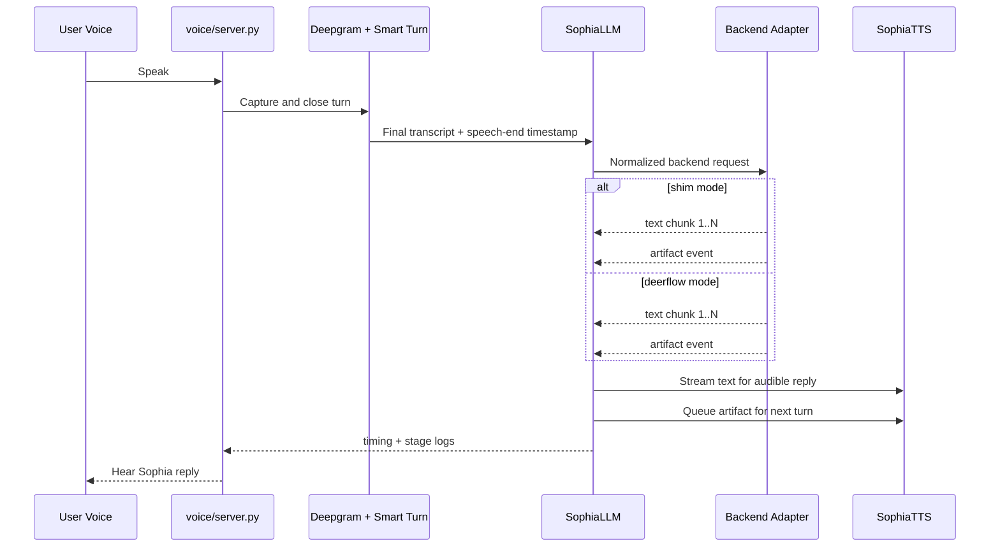

# feat: Add dual-mode Week 1 voice proof

## Overview

Add a contract-first proof path to the existing `voice/` scaffold so Luis can validate a real speak-to-hear Sophia loop now, without waiting for a real `sophia_companion` backend to land in the workspace.

The proof should run through the existing voice service, support a temporary `shim` backend mode and a later `deerflow` mode behind the same adapter seam, emit streamed text before a terminal artifact payload, and surface enough timing and failure information that the operator can tell whether the loop is viable.

## Problem Frame

The current repo already has the Week 1 voice scaffold in `voice/`, but it does not yet contain a real Sophia backend implementation to stream from. Waiting on backend work would stall Week 1, while building a one-off voice demo that ignores the future contract would create throwaway integration work.

This plan keeps the Week 1 proof honest: prove the transport and orchestration loop now, preserve the future `runs/stream` contract boundary, and make the eventual swap to a real backend configuration-driven rather than architectural.

## Requirements Trace

- R1. Produce a local voice smoke test where a human can speak, the system detects turn end, Sophia responds with streamed text, and the response is heard as audio.
- R2. Optimize for integration smoke, not polish.
- R3. Support a dual-mode backend strategy: `shim` now, real backend later.
- R4. Preserve the observable DeerFlow contract shape: streamed assistant text, then a separate artifact payload/event path.
- R5. Make backend swapping configuration-driven behind one voice stack.
- R6. Emit a synthetic artifact in shim mode that is close enough to the expected Sophia artifact shape to exercise parsing and handoff.
- R7. Capture the minimum timing checkpoints for Week 1 decisions: speech end to first streamed text, and speech end to first audible TTS output.
- R8. Run the proof through the existing `voice/` service directly.
- R9. End with an operator checklist for running the proof and for later swapping to a real backend.
- R10. Define minimum failure behavior for silence or empty transcript input, placeholder-backend unavailability, and upstream STT or TTS errors.
- R11. Make stage-level failures observable without requiring code inspection.

## Scope Boundaries

- No real `sophia_companion` backend implementation is created in this block.
- No Week 2 voice-emotion polish or latency-target tuning to `< 3s` is attempted here.
- No memory candidates, Journal, frontend, gateway, nginx, or iOS work is part of this plan.
- No new parallel voice path is introduced outside the existing `voice/` scaffold.

## Context & Research

### Relevant Code and Patterns

- `voice/config.py` already centralizes environment loading, settings validation, and the LLM mode switch.
- `voice/sophia_llm.py` already contains the main streaming orchestration, per-user thread caching, and helper logic for extracting text and artifacts from DeerFlow-style events.
- `voice/sophia_tts.py` already stores the latest artifact state for next-turn TTS settings.
- `voice/server.py` is already the canonical entrypoint for agent creation, Smart Turn wiring, and the current logging/bootstrap path.
- `voice/README.md` is already the operator entrypoint for install and run instructions.
- `docs/specs/04_backend_integration.md` and `docs/specs/06_implementation_spec.md` define the target backend contract direction: `runs/stream`, separate post-text artifact handling, and platform-aware requests.
- `CLAUDE.md` adds hard constraints that matter to this proof: `runs/stream` for voice, artifact on every companion turn, and platform in `configurable`.

### Institutional Learnings

- No matching `docs/solutions/` entry or prior reusable shim/runbook document was found in the repo.
- Existing validated scaffold learnings should be preserved during implementation: use `voice/.venv` rather than the repo root `.venv`, keep Smart Turn as the only turn detector by disabling `DeepgramSTT.turn_detection`, and preserve the current `agent.create_call()` then `async with agent.join(call): await agent.finish()` join pattern.

### External References

- External research is intentionally skipped for this plan. The work is bounded to a shimmed proof on top of an already-researched stack, and the local scaffold plus Sophia specs are sufficient to define the approach responsibly.

## Key Technical Decisions

- Introduce a single backend-adapter seam beneath `SophiaLLM`, not a second orchestration path in `server.py`.
  Rationale: this keeps turn flow, TTS handoff, and Voice Agents wiring identical across `shim` and `deerflow` modes.

- Standardize the Week 1 proof on `shim` and `deerflow` modes. If the current direct `anthropic` path is retained temporarily, it should be treated as a non-proof fallback and not as an acceptance path for Week 1.
  Rationale: the direct model path does not exercise the stream-plus-artifact split that the future backend requires.

- Normalize backend output into one internal event sequence: streamed text chunks first, then a terminal artifact event, plus a stage-labeled error path.
  Rationale: the adapter contract, not raw backend payload shapes, should be the stable seam that the rest of the voice service depends on.

- Capture timing at the voice-service boundary, not through a separate UI or gateway layer.
  Rationale: this block is intentionally scoped to the direct `voice/` service, and operator-observable timings are enough for the Week 1 decision.

- Fail service readiness closed when the selected mode or required live providers are unavailable.
  Rationale: a partial startup would create misleading smoke-test results and blur the failing stage.

- Prefer operator-facing logs and stage markers over new UI for Week 1 observability.
  Rationale: the proof is a service-level validation slice, and logs are the lowest-carrying-cost way to debug stage failures now.

## Open Questions

### Resolved During Planning

- Should this proof wait for a real backend? No. The proof should proceed now in `shim` mode and preserve the later `deerflow` swap behind the same seam.
- Should this run through the broader app stack? No. The canonical execution path for Week 1 is the direct `voice/` service entrypoint.
- Does this need external research before planning? No. The repo scaffold and Sophia specs already bound the problem tightly enough.

### Deferred to Implementation

- The exact synthetic text copy and artifact values used by the shim can be finalized during implementation, as long as the event order and required fields are preserved.
- The exact hook for “first audible TTS output” can be chosen during implementation based on what Vision Agents and the Cartesia wrapper expose cleanly.
- Whether the legacy `anthropic` mode remains in the codebase after the proof is complete can be decided during implementation cleanup, as long as the Week 1 acceptance path is clearly `shim`/`deerflow`.

## High-Level Technical Design

> *This illustrates the intended approach and is directional guidance for review, not implementation specification. The implementing agent should treat it as context, not code to reproduce.*

## Implementation Units

- [x] **Unit 1: Extract backend adapter seam and proof-mode configuration**

**Goal:** Introduce a single backend adapter boundary so the existing voice service can switch between `shim` and `deerflow` without changing turn orchestration.

**Requirements:** R3, R5, R8, R9, R11

**Dependencies:** None

**Files:**
- Create: `voice/adapters/__init__.py`
- Create: `voice/adapters/base.py`
- Create: `voice/adapters/shim.py`
- Create: `voice/adapters/deerflow.py`
- Create: `voice/requirements-dev.txt`
- Create: `voice/tests/test_config.py`
- Create: `voice/tests/test_adapter_selection.py`
- Modify: `voice/config.py`
- Modify: `voice/sophia_llm.py`

**Approach:**
- Move backend-specific streaming work out of `SophiaLLM` into adapter modules so `SophiaLLM` stays responsible for Vision Agents events, conversation history, and artifact handoff.
- Extend settings to represent the proof backend mode explicitly while preserving existing platform, context, and ritual inputs for both modes.
- Normalize adapter output around one internal event model that covers streamed text, artifact delivery, and stage-labeled errors.
- Keep the service entrypoint unchanged: `voice/server.py` should still create one `SophiaLLM` instance that receives a selected adapter.

**Execution note:** Start with failing config and adapter-selection tests so the seam is locked before any shim behavior is added.

**Patterns to follow:**
- Settings/dataclass validation pattern in `voice/config.py`
- Existing streaming ownership and thread reuse pattern in `voice/sophia_llm.py`

**Test scenarios:**
- Happy path: selecting `shim` mode builds the shim adapter and preserves `platform`, `context_mode`, and `ritual` values for downstream request construction.
- Happy path: selecting `deerflow` mode builds the deerflow adapter and keeps per-user thread reuse behavior intact.
- Edge case: an unsupported backend mode is rejected during settings validation.
- Error path: selecting a backend mode with incomplete mode-specific configuration fails readiness validation instead of silently falling back.
- Integration: `SophiaLLM` delegates all backend-specific response handling through the adapter interface in both `shim` and `deerflow` modes.

**Verification:**
- The voice service can be started through the same entrypoint as before, and logs identify which adapter mode is active.
- No backend-specific branching remains in `voice/server.py`.

- [x] **Unit 2: Implement the contract-respecting shim and artifact lifecycle**

**Goal:** Make the service capable of completing a realistic one-turn voice proof without a real Sophia backend while preserving the stream-then-artifact contract the real backend will use.

**Requirements:** R1, R4, R6, R7, R10, R11

**Dependencies:** Unit 1

**Files:**
- Create: `voice/tests/test_shim_adapter.py`
- Create: `voice/tests/test_sophia_llm_streaming.py`
- Modify: `voice/adapters/shim.py`
- Modify: `voice/adapters/deerflow.py`
- Modify: `voice/sophia_llm.py`
- Modify: `voice/sophia_tts.py`

**Approach:**
- Implement a shim adapter that emits deterministic text chunks followed by a synthetic artifact close enough to the Sophia artifact contract to exercise parsing and next-turn TTS state.
- Route both shim and deerflow adapter outputs through the same normalized event sequence so `SophiaLLM` does not care which backend produced them.
- Keep artifact handoff behavior strict: text chunks stream first, artifact is applied only after the text stream completes, and missing or malformed artifacts are surfaced as contract failures rather than silent success.
- Preserve `SophiaTTS` as the next-turn state holder so Week 2 emotion work builds on the same object and not a throwaway proof-specific path.

**Execution note:** Start with failing stream-order tests and a failing “artifact applies on next turn” test before adjusting TTS handoff.

**Patterns to follow:**
- Existing `_extract_ai_chunk`, `_extract_artifact`, and normalized event parsing logic in `voice/sophia_llm.py`
- Existing next-turn artifact queue in `voice/sophia_tts.py`

**Test scenarios:**
- Happy path: the shim emits multiple text chunks and `SophiaLLM` forwards them in order before completion.
- Happy path: the shim emits a terminal artifact that is stored in `last_artifact` and forwarded to `SophiaTTS` only after text streaming completes.
- Edge case: a second turn can still observe the previous turn’s queued artifact state for next-turn TTS settings.
- Error path: a forced shim failure produces a stage-labeled backend error and returns the service to a recoverable state.
- Error path: a missing or malformed artifact is treated as a contract violation rather than a successful turn.
- Integration: the shim and deerflow adapters both produce the same normalized event sequence to `SophiaLLM`.

**Verification:**
- A one-turn proof can complete in `shim` mode without any real Sophia backend.
- Operator logs show streamed text activity and a terminal artifact event as separate stages.

- [x] **Unit 3: Add readiness gating, timing telemetry, and the operator smoke runbook**

**Goal:** Make the Week 1 proof runnable and diagnosable through the current voice-service entrypoint with no extra UI or orchestration layer.

**Requirements:** R1, R2, R7, R8, R9, R10, R11

**Dependencies:** Unit 1, Unit 2

**Files:**
- Create: `voice/tests/test_server_readiness.py`
- Create: `voice/tests/test_turn_metrics.py`
- Modify: `voice/config.py`
- Modify: `voice/server.py`
- Modify: `voice/sophia_llm.py`
- Modify: `voice/README.md`

**Approach:**
- Add explicit readiness gating so the service refuses the proof path when the selected adapter mode or required live providers are unavailable.
- Record stage-tagged timings for `speech end -> first streamed text` and `speech end -> first audible TTS output`, plus stage-tagged failures for silence, STT failure, adapter timeout, and TTS failure.
- Ensure recoverable failures reset the active turn/session state cleanly so a second proof attempt can run without restarting the process.
- Update `voice/README.md` into a real Week 1 operator runbook: env matrix, `shim` vs `deerflow` mode selection, exact smoke steps, pass criteria, failure interpretation, and the later swap checklist once `sophia_companion` exists.

**Patterns to follow:**
- Existing logging/bootstrap pattern in `voice/server.py`
- Existing environment loading and validation pattern in `voice/config.py`
- Existing run instructions and notes structure in `voice/README.md`

**Test scenarios:**
- Happy path: valid `shim` configuration reports ready and logs both timing checkpoints during a completed turn.
- Edge case: silence or an empty transcript returns the service to a ready state without a restart.
- Error path: STT initialization failure keeps the service not ready and identifies the failing stage.
- Error path: adapter timeout during streaming aborts the turn, logs the failing stage, and still allows a fresh session afterward.
- Error path: TTS failure after a successful text stream does not leave the session stuck in a speaking state.
- Integration: disconnecting or ending a session cleans up active turn state and allows a second session without restarting the service.

**Verification:**
- A teammate can run the documented smoke proof from `voice/README.md` and determine pass/fail from logs and audible behavior alone.
- The same smoke harness remains usable later by changing configuration from `shim` to `deerflow`.

## System-Wide Impact

- **Interaction graph:** `voice/server.py` remains the service entrypoint; STT and Smart Turn feed `SophiaLLM`; `SophiaLLM` delegates to one backend adapter; `SophiaTTS` remains the artifact handoff point.
- **Error propagation:** stage-level errors should surface from STT, adapter, and TTS back to logs with a clear stage tag and should reset the turn/session state when recoverable.
- **State lifecycle risks:** queued artifacts, active-turn state, and per-user thread ids must not leak across failed sessions or leave the service stuck after a recoverable error.
- **API surface parity:** the normalized adapter contract must remain consistent between `shim` and `deerflow` so the swap to a real backend does not change the voice-service surface.
- **Integration coverage:** the plan explicitly requires live smoke verification because unit tests alone cannot prove stream ordering, audible playback, or recoverable session cleanup.
- **Unchanged invariants:** this block does not change frontend routes, gateway wiring, `Makefile` orchestration, Mem0 behavior, or any Sophia backend graph registration.

## Risks & Dependencies

| Risk | Mitigation |
|------|------------|
| The shim drifts from the real backend contract and creates rework later. | Normalize both `shim` and `deerflow` through the same adapter interface and keep the real adapter in the plan from the start rather than postponing it. |
| Required live provider credentials are missing, making the proof impossible to run. | Fail readiness closed, document the env matrix clearly, and treat missing providers as an explicit environment blocker rather than a flaky proof result. |
| First-audio timing is harder to capture than first-text timing. | Instrument timing where the TTS wrapper or playback callback can expose it cleanly, and document the fallback measurement point if the framework hook is coarser than desired. |
| Recoverable failures leave the service in a bad state and force process restarts during the proof. | Add explicit cleanup/reset expectations and test them through silence, timeout, disconnect, and TTS/STT failure scenarios. |

## Documentation / Operational Notes

- Expand `voice/README.md` from a scaffold note into the Week 1 proof runbook.
- Document the difference between proof mode and future real-backend mode so operators do not mistake the shim for full Sophia behavior.
- Preserve the existing note that `voice/.venv` is the authoritative environment for voice validation on this repo.

## Sources & References

- **Origin document:** `docs/brainstorms/week1-voice-proof-requirements.md`
- Related code: `voice/config.py`
- Related code: `voice/server.py`
- Related code: `voice/sophia_llm.py`
- Related code: `voice/sophia_tts.py`
- Related code: `voice/README.md`
- Related spec: `docs/specs/04_backend_integration.md`
- Related spec: `docs/specs/06_implementation_spec.md`
- Repo context: `CLAUDE.md`