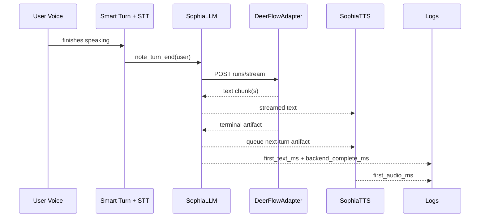

# feat: Harden DeerFlow runs/stream voice integration

## Overview

Close the remaining Day 3-4 gap for the Week 1 voice proof by hardening the real `deerflow` backend path under `voice/`, adding contract-level tests for streamed text plus terminal artifact handling, and exposing an operator-visible completion metric so Luis can measure the full speak-to-hear path against the `< 3s` target.

The repo already has the adapter seam, `runs/stream` request path, streamed text chunk forwarding, and next-turn artifact queue. What remains is to make the DeerFlow path verifiable rather than assumed: prove the adapter parses the real contract shape safely, preserve enough turn state to measure the backend completion window in addition to TTFT and first audio, and document the exact smoke checklist for `deerflow` mode.

## Problem Frame

The current implementation is no longer greenfield. `voice/sophia_llm.py`, `voice/adapters/deerflow.py`, `voice/sophia_tts.py`, and `voice/server.py` already implement the intended Week 1 architecture: `runs/stream`, chunked text forwarding, separate `emit_artifact` handling, and Smart Turn timing hooks.

What is still weak is the confidence layer around the real backend mode. The voice test suite currently covers shim behavior and generic LLM streaming behavior, but it does not include a dedicated DeerFlow adapter contract test file. The runtime also logs `first_text_ms` and `first_audio_ms`, but it does not log a durable backend-complete metric that lets the operator distinguish `TTFT`, `backend stream completion`, and `first audible TTS` during the Day 3-4 smoke test. Without those two pieces, the code may be structurally correct yet still be hard to validate against the actual DeerFlow server.

## Requirements Trace

- R1. Keep `voice/sophia_llm.py` on `runs/stream`, never `runs/wait`.
- R2. Preserve chunk-by-chunk text forwarding so Cartesia can begin speaking before the full backend response is complete.
- R3. Preserve separate terminal `emit_artifact` handling that updates next-turn TTS state only.
- R4. Make the real `deerflow` adapter path testable against the documented Week 1 SSE contract.
- R5. Expose enough timing telemetry to measure Day 3-4 end to end: speech end to first streamed text, speech end to backend stream completion, and speech end to first audible TTS output.
- R6. Keep failures stage-labeled and recoverable where appropriate.
- R7. Update the operator runbook so Luis can run the Day 3-4 smoke path directly against DeerFlow.

## Scope Boundaries

- No new shim architecture or proof path redesign.
- No Week 2 voice-emotion rendering changes beyond preserving next-turn artifact semantics.
- No changes to the Sophia backend graph, middleware chain, or artifact schema.
- No frontend, Journal, or memory-candidate work in this slice.

## Context & Research

### Relevant Code and Patterns

- `voice/adapters/deerflow.py` already performs `/threads/{thread_id}/runs/stream` calls, passes `user_id`, `platform`, `ritual`, and `context_mode`, and extracts text plus artifact events.
- `voice/sophia_llm.py` already forwards chunk events to Vision Agents and validates the artifact contract strictly.
- `voice/sophia_tts.py` already stores artifact state for the next response rather than the current one.
- `voice/tests/test_sophia_llm_streaming.py` already proves stream-then-artifact ordering at the LLM layer, but only through a fake adapter.
- `voice/tests/test_turn_metrics.py` currently proves only `first_text_ms` and `first_audio_ms` logging.
- `voice/README.md` already distinguishes `shim` and `deerflow`, but the metric story is still incomplete for Day 3-4 verification.

### Institutional Learnings

- The earlier Week 1 voice proof plan is already marked complete, so this plan must target only the residual confidence gap instead of restating the whole proof architecture.
- The voice service should continue using `voice/.venv`, not the root `.venv`, for runtime and verification.
- Artifact handling is intentionally strict: missing or malformed artifact payloads are contract failures, not soft fallbacks.

### External Research

- External research is intentionally skipped. The remaining work is repository-shaped and bounded to a known contract between the local voice service and the DeerFlow server.

## Key Technical Decisions

- Add a dedicated DeerFlow adapter test file rather than only expanding the generic LLM streaming tests.
  Rationale: the weak point is the adapter's handling of real SSE framing and payload normalization, not the generic LLM event bridge.

- Extend turn metrics to include backend stream completion and retain turn state until both backend completion and first audio have had a chance to report.
  Rationale: Day 3-4 requires measuring TTFT, backend completion, and first audible TTS separately; the current lifecycle clears state too early for that full picture.

- Keep artifact application strict and terminal.
  Rationale: the build plan and CLAUDE constraints require `emit_artifact` after text, with next-turn effect only.

- Update the README as the operator-facing acceptance document for Day 3-4.
  Rationale: Week 1 success is an integration smoke, so the runbook must show exactly what logs and timings indicate success.

## Open Questions

### Resolved During Planning

- Is `voice/sophia_llm.py` still missing `runs/stream` integration? No. The main implementation already exists; the gap is verification and timing completeness.
- Is the artifact handoff still blocking Day 3-4? No. It is already queued for the next turn; that behavior should be preserved, not redesigned.

### Deferred to Implementation

- The exact metric name for backend completion can be finalized during implementation as long as it is operator-visible and clearly distinct from `first_text_ms` and `first_audio_ms`.
- The exact fake SSE payload variants in adapter tests can be finalized during implementation as long as they cover the documented `messages-tuple` contract and one malformed-contract case.

## High-Level Technical Design

## Implementation Units

- [x] **Unit 1: Add DeerFlow adapter contract tests**

**Goal:** Prove the real adapter correctly normalizes DeerFlow SSE events into text and terminal artifact events.

**Requirements:** R1, R2, R3, R4, R6

**Dependencies:** None

**Files:**
- Create: `voice/tests/test_deerflow_adapter.py`
- Modify: `voice/adapters/deerflow.py`

**Approach:**
- Add targeted adapter tests using a fake `httpx.AsyncClient` or transport seam so the adapter can be exercised without a live server.
- Cover the documented `messages-tuple` text shape, the `emit_artifact` tool payload shape, and malformed JSON or malformed artifact cases.
- Tighten the adapter only where tests reveal contract ambiguity or brittle parsing.

**Patterns to follow:**
- Existing normalized event model in `voice/adapters/base.py`
- Existing fake-adapter style in `voice/tests/test_sophia_llm_streaming.py`

**Test scenarios:**
- Happy path: a DeerFlow SSE stream yields multiple text chunks followed by one artifact payload.
- Happy path: artifact content provided as JSON string is parsed into a dict.
- Edge case: tuple-shaped `data` is normalized correctly before text or artifact extraction.
- Error path: invalid JSON from the SSE stream becomes a `backend-contract` error event.
- Error path: backend `error` or `run_error` event becomes a `backend-stream` error event.

**Verification:**
- The adapter test suite proves the `deerflow` path independently of the shim path.

- [x] **Unit 2: Extend timing telemetry to cover backend stream completion**

**Goal:** Make Day 3-4 timing measurable as TTFT, backend-complete time, and first-audio time from one turn.

**Requirements:** R2, R5, R6

**Dependencies:** Unit 1

**Files:**
- Modify: `voice/sophia_llm.py`
- Modify: `voice/tests/test_sophia_llm_streaming.py`
- Modify: `voice/tests/test_turn_metrics.py`

**Approach:**
- Extend the pending-turn metric state to track backend completion separately from first text and first audio.
- Avoid clearing the turn state at first audio if backend completion has not been recorded yet.
- Log a dedicated backend completion metric once the stream has fully completed and the terminal artifact has been accepted.

**Patterns to follow:**
- Existing `first_text_ms` and `first_audio_ms` metric hooks in `voice/sophia_llm.py`

**Test scenarios:**
- Happy path: streamed text, terminal artifact, and TTS first audio all produce distinct metrics in one turn.
- Edge case: first audio happens before backend completion and the final completion metric still logs.
- Error path: backend failure clears pending state and does not leak stale timing into the next turn.

**Verification:**
- Operators can read logs and distinguish TTFT from backend completion and first audible TTS.

- [x] **Unit 3: Update the operator runbook for real DeerFlow smoke mode**

**Goal:** Give Luis an exact Day 3-4 checklist for running the voice loop against DeerFlow and reading the timing output.

**Requirements:** R5, R7

**Dependencies:** Unit 2

**Files:**
- Modify: `voice/README.md`

**Approach:**
- Add a DeerFlow smoke checklist with env vars, launch command, expected logs, and pass/fail interpretation.
- Document the three timing signals explicitly and tie them back to the Day 3-4 target.

**Patterns to follow:**
- Existing Week 1 smoke sections already present in `voice/README.md`

**Test scenarios:**
- Happy path: the runbook names the exact commands and success signals for DeerFlow mode.
- Error path: the runbook maps stage-labeled errors to likely failing layers.

**Verification:**
- A teammate can run the DeerFlow path and decide whether Day 3-4 is complete from logs plus audible behavior alone.

## System-Wide Impact

- The `voice/` service remains the single Week 1 proof path.
- No change to shim behavior beyond shared metric lifecycle.
- The main new confidence comes from stronger DeerFlow adapter tests and clearer operator observability.

## Risks & Dependencies

| Risk | Mitigation |
|------|------------|
| Real DeerFlow SSE payloads differ slightly from the current assumptions. | Cover multiple tuple/data shapes in the dedicated adapter tests and tighten parsing only where needed. |
| Measuring first audio clears turn state before backend completion. | Retain pending turn state until both signals have had a chance to report or until an explicit error/cleanup path fires. |
| Operator logs are still too vague to judge the Day 3-4 target. | Add an explicit backend completion metric and document how to read it in the README. |

## Sources & References

- Origin document: `docs/specs/02_build_plan.md`
- Related plan: `docs/plans/2026-03-29-001-feat-week1-voice-proof-plan.md`
- Related code: `voice/adapters/deerflow.py`
- Related code: `voice/sophia_llm.py`
- Related code: `voice/sophia_tts.py`
- Related code: `voice/README.md`