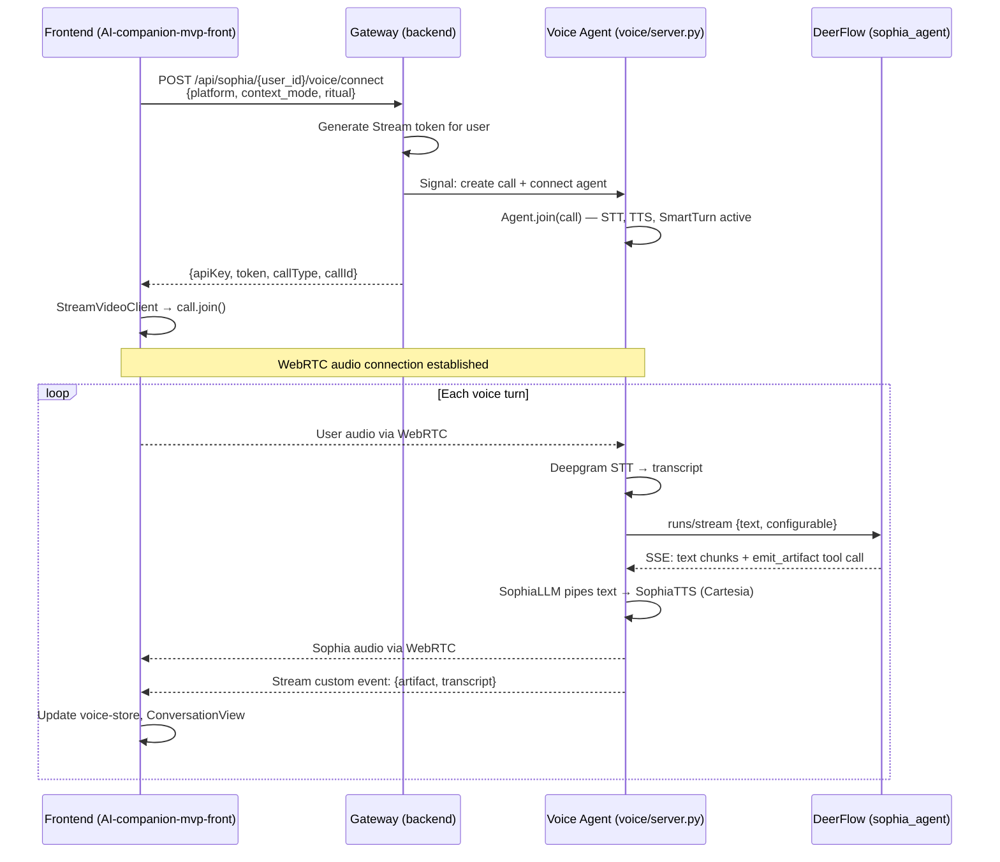

# refactor: Migrate Voice Transport from WebSocket to Stream WebRTC

## Overview

Replace AI-companion-mvp-front's custom WebSocket voice system (~40 files handling client-side audio capture, PCM streaming, turn detection, and playback) with Stream WebRTC via `@stream-io/video-react-sdk`. The new backend voice pipeline (Vision Agents + DeerFlow) handles STT, turn detection, TTS, and audio transport server-side — the frontend's role shrinks to joining a WebRTC room and rendering UI state.

## Problem Frame

The old voice system duplicates every responsibility the server-side pipeline already handles. ~30 files of client-side plumbing (MediaRecorder, AudioContext, WebSocket message protocol, PCM encoding/decoding) block integration with the new pipeline's capabilities (artifact-driven emotion, Smart Turn detection, platform-adaptive middleware) and must be maintained in parallel. (see origin: docs/brainstorms/2026-03-30-voice-migration-requirements.md)

## Requirements Trace

- R1. WebSocket → Stream WebRTC transport replacement
- R2. Voice sessions establish through Vision Agents (voice/server.py)
- R3. Pass `platform` in connection metadata
- R4. Pass `user_id`, `context_mode`, `ritual` alongside platform
- R5. Voice UI components continue functioning with new state signals
- R6. VoiceTranscript shows finalized per-turn STT output from server
- R7. Emotion/speed handled server-side only (no frontend processing)
- R8. `emit_artifact` data reaches frontend for session continuity display
- R9. Artifact consumers receive data in expected or adapted shape
- R10–R12. Retire client-side audio capture, playback, and WebSocket protocol (excluding onboarding voice files)
- R13. Retained files consume Stream events instead of VoiceLoopReturn
- R14. Session voice orchestration rewired or replaced with simpler Stream lifecycle hook
- R15. WebSocket-only session hooks retired
- R16. Stream WebRTC functional inside Capacitor WKWebView

## Scope Boundaries

- Text chat rewiring to DeerFlow `runs/stream` — deferred (see origin)
- Onboarding voice (onboarding/voice.ts, onboarding/ui/useOnboardingVoice.ts) — deferred; excluded from retirement
- Voice Layer backend (voice/server.py, sophia_llm.py, sophia_tts.py, adapters/) — no changes except artifact forwarding hook
- New voice UI features — none; existing components preserved and rewired
- VoiceFirstDashboard/VoiceFirstComposer — in scope for rewiring (they consume voice state, not WebSocket internals)

## Context & Research

### Relevant Code and Patterns

**Stream React SDK pattern** (from Stream AI Voice Assistant tutorial):
```
StreamVideoClient({apiKey, user, token}) → client.call('default', callId) → call.join({create: true})
Wrap in <StreamVideo client={client}><StreamCall call={call}>{children}</StreamCall></StreamVideo>
useCallStateHooks() → { useCallCallingState, useParticipants, useLocalParticipant, useRemoteParticipants }
CallingState: IDLE, RINGING, JOINING, JOINED, LEFT
ParticipantsAudio handles remote audio playback automatically
participant.isSpeaking, participant.audioStream available for visualization
```

**Existing voice system interface** (`VoiceLoopReturn` from `useVoiceLoop.ts`):
```
stage: VoiceStage ("idle"|"connecting"|"listening"|"thinking"|"speaking"|"error")
partialReply, finalReply, isReflectionTtsActive, error, needsUnlock, stream
startTalking(), stopTalking(), speakText(), retryLastVoiceTurn(), bargeIn(), unlockAudio(), resetVoiceState()
```

**Voice store** (`voice-store.ts`): Zustand store with `VoiceMessage[]`, failure tracking (`hasVoiceFailed`, `failureCount`, `shouldAutoFallback()`), used by ConversationView and InputModeIndicator.

**ConversationView.tsx** consumes `useVoiceLoop()` → passes `voiceState` to VoicePanel/VoiceFocusView/VoiceCollapsed. Checks `shouldAutoFallback()` for text mode switch.

**Session hooks classification** (from codebase research):
| Hook | WebSocket-specific? | Decision |
|------|---------------------|----------|
| useSessionVoiceCommandSystem | Yes — WebSocket command routing | RETIRE |
| useSessionVoiceMessages | No — thin message append wrapper | RETIRE |
| useSessionVoiceUiControls | No — state machine glue for current stages | RETIRE |
| useVoiceToggle | Indirect — imports VoiceStage enum | RETIRE |
| useSessionCancelledRetryVoiceReplay | No — generic retry logic | KEEP |
| useSessionReflectionVoiceFlow | No — core feature logic | KEEP |
| useSessionVoiceBridge | Bridge layer — simplifies with Stream | REPLACE |
| useSessionVoiceOrchestration | Mostly session logic | REPLACE |

**VoiceFirstDashboard/VoiceFirstComposer**: Zero WebSocket imports. Pure UI components consuming generic `voiceStatus` string and callback props. No code changes needed beyond wiring to new state source.

**VoiceTranscript.tsx**: Pure display component, zero voice-system imports. Accepts `partialReply`/`finalReply` strings. Survives unchanged.

**VoiceRecorder.tsx**: Already REST-based (posts to `/defi-chat/stream`), not WebSocket. Needs endpoint update for new pipeline.

### External References

- Stream React Video SDK tutorial: https://getstream.io/video/sdk/react/tutorial/video-calling/
- Stream AI Voice Assistant tutorial: https://getstream.io/video/sdk/react/tutorial/ai-voice-assistant/
- Vision Agents GitHub: https://github.com/GetStream/vision-agents
- Spec: `docs/specs/05_frontend_ux.md` — sections 2.2 (Stream WebRTC Integration), 2.3 (runs/stream), 2.4 (Artifact handling in SophiaLLM)

## Key Technical Decisions

- **Stream custom events for artifact forwarding** over separate SSE endpoint: SophiaLLM already extracts the artifact in `_stream_backend()`. Adding a callback to emit it as a Stream custom event on the call is minimal server-side work and delivers artifacts in real-time over the existing WebRTC connection. A separate endpoint would add latency and a second connection to manage. (Resolves deferred Q from origin affecting R8.)

- **Single `useStreamVoiceSession` hook replaces useVoiceLoop + useSessionVoiceOrchestration + useSessionVoiceBridge**: The old system required 3 layers of hooks because WebSocket message handling was complex. Stream SDK handles transport natively — one hook can manage call lifecycle (join/leave), map participant events to voice stage, and route transcripts/artifacts. This eliminates the bridge and orchestration layers entirely. (Resolves deferred Q from origin affecting R14.)

- **VoiceStage type preserved, source changes**: Keep the same `VoiceStage` enum (`idle | connecting | listening | thinking | speaking | error`) since all UI components depend on it. Map from Stream SDK state:
  - `idle` → no call or `CallingState.IDLE`
  - `connecting` → `CallingState.JOINING`
  - `listening` → `CallingState.JOINED` + agent not speaking + user mic active
  - `thinking` → user stopped speaking (silence detected) but agent hasn't started
  - `speaking` → agent participant `isSpeaking === true`
  - `error` → call error events

- **Onboarding WebSocket carve-out**: R10–R12 retire all WebSocket code *except* files that `onboarding/voice.ts` and `onboarding/ui/useOnboardingVoice.ts` depend on. During file retirement (Unit 6), trace onboarding imports and exclude any shared utilities they need. (see origin)

- **Backend token endpoint in gateway**: Frontend needs a Stream user token (signed server-side with STREAM_API_SECRET). This goes in `backend/app/gateway/routers/` as a new voice router or extension to sophia.py. The Voice Layer creates the call and connects the agent; the frontend joins the same call with the returned credentials. (see origin: Dependencies/Assumptions)

## Open Questions

### Resolved During Planning

- **Stream SDK → VoiceStage mapping**: Resolved via CallingState + participant.isSpeaking + silence detection gap. See Key Technical Decisions above.
- **Artifact forwarding mechanism**: Resolved — Stream custom events emitted by the Voice Layer after SophiaLLM extracts the artifact.
- **Session orchestration simplification**: Resolved — single `useStreamVoiceSession` hook replaces 3-layer stack.
- **Session hook retirement**: Resolved — useSessionVoiceCommandSystem, useSessionVoiceMessages, useSessionVoiceUiControls, useVoiceToggle all retire. useSessionCancelledRetryVoiceReplay and useSessionReflectionVoiceFlow survive as-is.

### Deferred to Implementation

- **Exact Stream custom event payload shape**: Whether the full 13-field artifact is forwarded or a frontend-relevant subset. Depends on what ConversationView and voice-store actually read from the artifact today.
- **Onboarding WebSocket import trace**: Which specific utility files from hooks/voice/ are needed by onboarding and must be excluded from deletion. Trace at retirement time.
- **Smart Turn "thinking" detection on frontend**: Resolved — Voice Layer emits `sophia.turn` custom events. Frontend listens for `{phase: "user_ended"}` → set stage to `thinking`, then `{phase: "agent_started"}` → set stage to `speaking`. Fallback: if no `sophia.turn` event arrives, detect via 500ms timeout after `participant.isSpeaking` goes false for user. See custom event schemas in Unit 1.
- **VoiceRecorder.tsx endpoint migration**: Whether VoiceRecorder's `/defi-chat/stream` REST endpoint should point to the new Vision Agents pipeline or be bypassed entirely in favor of the WebRTC audio path.

## High-Level Technical Design

> *This illustrates the intended approach and is directional guidance for review, not implementation specification. The implementing agent should treat it as context, not code to reproduce.*



## Implementation Units

- [ ] **Unit 1: Backend prerequisite — Stream token endpoint + artifact forwarding hook**

**Goal:** Provide the frontend with Stream credentials to join a call, and forward artifact data to the frontend via Stream custom events.

**Requirements:** R2, R3, R4, R8

**Dependencies:** None — this unblocks all frontend units.

**Files:**
- Create: `backend/app/gateway/routers/voice.py` (or extend `sophia.py`)
- Modify: `voice/sophia_llm.py` — add artifact forwarding callback
- Test: `backend/tests/test_voice_gateway.py`

**Approach:**
- Gateway endpoint: `POST /api/sophia/{user_id}/voice/connect` accepts `{platform, context_mode, ritual}`, generates a Stream user token using `STREAM_API_SECRET`, creates or references a call, signals Voice Agent to connect, returns `{apiKey, token, callType, callId}`.
- Artifact forwarding: Add `attach_call_emitter(callback: Callable[[dict], Awaitable[None]])` to SophiaLLM. After `_stream_backend()` extracts the artifact, invoke `self._call_emitter(artifact_payload)`. The Voice Agent wires this to `call.send_custom_event()` during agent setup. This parallels the existing `attach_tts()` pattern.
- Token generation follows the Stream Node SDK pattern: `streamClient.generateUserToken({user_id})`, adapted for Python using the `stream-chat` or `getstream` Python SDK.

**Custom event schemas (frontend contract):**
```json
// Artifact event (emitted after SophiaLLM completes a turn)
{"type": "sophia.artifact", "data": {"session_goal": "...", "tone_estimate": 2.1, "voice_emotion_primary": "...", ...}}
// Transcript event (emitted after Deepgram STT finalizes)
{"type": "sophia.transcript", "data": {"text": "...", "is_final": true}}
// Turn lifecycle event (emitted by SmartTurnDetection)
{"type": "sophia.turn", "data": {"phase": "user_ended" | "agent_processing" | "agent_started"}}
```

**Patterns to follow:**
- Existing gateway routers: `backend/app/gateway/routers/agents.py`, `backend/app/gateway/routers/artifacts.py`
- Stream AI Voice Assistant tutorial server.mjs `/credentials` and `/:callType/:callId/connect` endpoints

**Test scenarios:**
- Happy path: POST /voice/connect with valid user_id and platform → returns valid apiKey, token, callType, callId
- Happy path: Artifact forwarded as Stream custom event after SophiaLLM processes a turn — custom event contains required session continuity fields
- Error path: POST /voice/connect with missing platform → 422 response
- Error path: Voice Agent connection failure → returns error response, does not leave dangling calls

**Verification:**
- Frontend can call the endpoint and receive valid Stream credentials
- After a voice turn, artifact data appears as a Stream custom event receivable by a test client

---

**Migration strategy — feature flag:**
Gate Units 2–5 behind a `STREAM_VOICE_ENABLED` feature flag in voice-store. When `false`, ConversationView uses the old `useVoiceLoop`. When `true`, it uses `useStreamVoiceSession`. This allows gradual rollout: deploy new system disabled, test in staging, flip flag, then retire old files (Unit 6). The flag is removed when Unit 6 completes.

- [ ] **Unit 2: Install Stream SDK and create voice provider infrastructure**

**Goal:** Add `@stream-io/video-react-sdk` to the project and create the provider scaffolding that all voice components will use.

**Requirements:** R1, R5

**Dependencies:** None (can proceed in parallel with Unit 1).

**Files:**
- Modify: `AI-companion-mvp-front/package.json` — add `@stream-io/video-react-sdk`
- Create: `AI-companion-mvp-front/src/app/hooks/useStreamVoice.ts` — Stream client initialization + call join/leave
- Create: `AI-companion-mvp-front/src/app/components/StreamVoiceProvider.tsx` — `<StreamVideo>` + `<StreamCall>` wrapper
- Test: `AI-companion-mvp-front/tests/hooks/useStreamVoice.test.ts`

**Approach:**
- Install `@stream-io/video-react-sdk` via npm/pnpm.
- `useStreamVoice` hook: accepts `{userId, apiKey, token, callType, callId}`, creates `StreamVideoClient`, manages `call.join()` / `call.leave()` lifecycle, exposes `{client, call, callingState}`.
- `StreamVoiceProvider`: wraps children in `<StreamVideo client={client}><StreamCall call={call}>`. Only renders when a voice call is active.
- Camera disabled immediately on join (`call.camera.disable()`) — this is audio-only.

**Patterns to follow:**
- Stream AI Voice Assistant tutorial `App.tsx` — `<StreamVideo>` / `<StreamCall>` nesting pattern
- Stream SDK `useCallStateHooks()` for state access within the provider

**Test scenarios:**
- Happy path: Hook initializes with valid credentials → callingState transitions from IDLE → JOINING → JOINED
- Happy path: Hook cleanup on unmount → call.leave() called, client disconnected
- Edge case: Double-join prevention — calling join when already joined is a no-op
- Error path: Invalid credentials → callingState goes to error state, hook returns error

**Verification:**
- StreamVoiceProvider renders and provides call context to children
- Voice call connects and audio flows (manual test with running Voice Agent)

---

- [ ] **Unit 3: Build `useStreamVoiceSession` hook — replaces useVoiceLoop**

**Goal:** Create the new main voice hook that maps Stream SDK events to the `VoiceStage` interface all UI components depend on. This single hook replaces useVoiceLoop + useSessionVoiceOrchestration + useSessionVoiceBridge.

**Requirements:** R1, R5, R6, R8, R9, R13, R14

**Dependencies:** Unit 1 (token endpoint), Unit 2 (Stream SDK infrastructure)

**Files:**
- Create: `AI-companion-mvp-front/src/app/hooks/useStreamVoiceSession.ts`
- Modify: `AI-companion-mvp-front/src/app/stores/voice-store.ts` — adapt event source, keep shape
- Test: `AI-companion-mvp-front/tests/hooks/useStreamVoiceSession.test.ts`

**Approach:**
- Export a type-compatible interface with the essential fields of `VoiceLoopReturn`: `stage`, `partialReply`, `finalReply`, `startTalking`, `stopTalking`, `bargeIn`, `resetVoiceState`.
- `stage` mapping: Use `useCallCallingState()` + agent participant's `isSpeaking` + local participant mute state. `CallingState.JOINING` → `connecting`. `JOINED` + agent silent + user mic active → `listening`. Agent `isSpeaking` → `speaking`. Gap between user silence and agent speech → `thinking`.
- Transcript handling: Listen for Stream custom events from the Voice Layer containing finalized STT transcript text. Update `finalReply` state. Feed into `voice-store.addMessage()`.
- Artifact handling: Listen for Stream custom events containing artifact data. Transform to the shape `chat-voice-artifacts.ts` expects. Feed into the artifact consumer callback (same `onArtifacts` pattern ConversationView uses today).
- `startTalking`: Call the token endpoint (Unit 1), join the Stream call via `useStreamVoice`, unmute mic.
- `stopTalking`: Mute mic + leave call (or mute only if session continues).
- `bargeIn`: Leave or mute — the Voice Agent handles barge-in server-side when the user starts speaking.
- `voice-store.ts`: Keep `VoiceMessage[]` and failure tracking. Change the event source: instead of WebSocket message parsing, populate from Stream custom events. `shouldAutoFallback()` logic remains (failure count tracking).

**Patterns to follow:**
- `useCallStateHooks()` from Stream SDK for state
- `call.on('custom', handler)` for receiving custom events (transcript + artifact)
- Existing `VoiceLoopReturn` type shape from `useVoiceLoop.ts` for interface compatibility

**Test scenarios:**
- Happy path: Call joins → stage transitions idle → connecting → listening → (agent speaks) → speaking → listening
- Happy path: User speaks → finalized transcript arrives via custom event → displayed in VoiceTranscript
- Happy path: Artifact arrives via custom event → voice-store updated → artifact consumers notified
- Edge case: Call drops mid-conversation → stage goes to error → failure tracking incremented in voice-store
- Edge case: Agent participant not yet joined → stage stays at connecting until agent appears
- Error path: Token endpoint fails → stage goes to error, auto-fallback triggers after threshold
- Integration: startTalking → token fetch → call join → Stream provider renders → audio flows → stopTalking → call leaves

**Verification:**
- ConversationView can use useStreamVoiceSession with the same destructured interface it uses from useVoiceLoop today
- Voice stage transitions match user-visible behavior (listening when mic active, speaking when Sophia responds)
- Artifacts appear in the same consumers (ConversationView, voice-store) as before

---

- [ ] **Unit 4: Rewire voice UI components to new transport**

**Goal:** Update VoicePanel, VoiceFocusView, VoiceCollapsed, VoiceMicButton, and ConversationView to consume `useStreamVoiceSession` instead of `useVoiceLoop`.

**Requirements:** R5, R9, R13

**Dependencies:** Unit 3 (useStreamVoiceSession hook)

**Files:**
- Modify: `AI-companion-mvp-front/src/app/components/ConversationView.tsx`
- Modify: `AI-companion-mvp-front/src/app/components/VoicePanel.tsx`
- Modify: `AI-companion-mvp-front/src/app/components/VoiceFocusView.tsx`
- Modify: `AI-companion-mvp-front/src/app/components/VoiceCollapsed.tsx`
- Modify: `AI-companion-mvp-front/src/app/components/VoiceMicButton.tsx`
- Modify: `AI-companion-mvp-front/src/app/components/session/VoiceFirstComposer.tsx`
- Modify: `AI-companion-mvp-front/src/app/chat/chat-voice-artifacts.ts`
- Test: `AI-companion-mvp-front/tests/components/ConversationView.voice.test.ts`

**Approach:**
- ConversationView: Replace `useVoiceLoop(userId, {sessionId, onArtifacts})` with `useStreamVoiceSession(userId, {sessionId, onArtifacts})`. The return type is interface-compatible, so the change is primarily the import and hook name. Remove imports of old voice hooks.
- VoicePanel, VoiceFocusView, VoiceCollapsed: These receive `voiceState` as a prop from ConversationView. If the prop type is compatible (same `stage` field), no changes needed. If they reference `VoiceLoopReturn` type directly, update the type import to use the new hook's return type.
- VoiceMicButton: If it imports voice-specific types, update. Logic (check stage, toggle recording) remains the same since the stage enum is preserved.
- VoiceFirstComposer: Already pure UI (accepts `voiceStatus` string + `onMicClick` callback). Wire from the new session that provides the voice state. No internal changes.
- chat-voice-artifacts.ts: Update to consume artifacts from the shape the Stream custom event provides. If the shape differs from today's WebSocket artifact format, add a thin adapter.

**Patterns to follow:**
- Existing component prop patterns in ConversationView.tsx
- VoiceFirstComposer's callback-only pattern (no internal transport knowledge)

**Test scenarios:**
- Happy path: ConversationView renders VoicePanel in "listening" state when user is speaking into Stream call
- Happy path: VoiceFocusView shows "speaking" animation when agent participant isSpeaking
- Happy path: Artifact data flows through chat-voice-artifacts.ts → ConversationView displays session_goal, takeaway
- Edge case: Voice error state → VoicePanel shows error UI → user can retry or fall back to text
- Integration: Full flow — user taps mic in ConversationView → call joins → speaks → transcript + artifact displayed → taps stop → call leaves

**Verification:**
- All 5 voice UI components render and transition states correctly with the new hook
- Artifacts appear in the ConversationView session continuity display
- VoiceFirstComposer mic dot colors match voice state

---

- [ ] **Unit 5: Rewire session integration + kept hooks**

**Goal:** Wire the kept session hooks (useSessionCancelledRetryVoiceReplay, useSessionReflectionVoiceFlow) to the new transport, and update the session page (session/page.tsx) to use the new voice system.

**Requirements:** R14, R15

**Dependencies:** Unit 3 (useStreamVoiceSession), Unit 4 (UI components rewired)

**Files:**
- Modify: `AI-companion-mvp-front/src/app/session/page.tsx`
- Modify: `AI-companion-mvp-front/src/app/session/useSessionCancelledRetryVoiceReplay.ts` (callback binding update if needed)
- Modify: `AI-companion-mvp-front/src/app/session/useSessionReflectionVoiceFlow.ts` (callback binding update if needed)
- Modify: `AI-companion-mvp-front/src/app/components/VoiceFirstDashboard.tsx` (verify wiring only)
- Test: `AI-companion-mvp-front/tests/session/session-voice-integration.test.ts`

**Approach:**
- session/page.tsx: Currently wires voice through 7 session-level hooks. Remove imports of retired hooks (useSessionVoiceOrchestration, useSessionVoiceBridge, useSessionVoiceMessages, useSessionVoiceUiControls, useSessionVoiceCommandSystem). Use `useStreamVoiceSession` directly — it already handles orchestration and bridging.
- useSessionCancelledRetryVoiceReplay: Already transport-agnostic. Only needs its `handleRetry()` callback wired to the new hook's retry mechanism. Verify it works when retry triggers a new backend request through the Stream pipeline.
- useSessionReflectionVoiceFlow: Already transport-agnostic. Uses `sendMessage()` and `speakText()` callbacks. Wire `sendMessage` to the new chat integration, `speakText` to the Stream call's audio path (or to a separate TTS request if needed).
- VoiceFirstDashboard: Zero voice imports today. Verify `useSessionStart` and `useConnectivity` still function — they're not WebSocket-specific.

**Patterns to follow:**
- Existing session/page.tsx hook wiring pattern
- Keep useSessionCancelledRetryVoiceReplay and useSessionReflectionVoiceFlow as standalone hooks — they work precisely because they're decoupled from transport

**Test scenarios:**
- Happy path: Session page loads → voice connected via Stream → conversation works end-to-end
- Happy path: Retry flow — user retries → new response arrives → auto-speaks via TTS
- Happy path: Reflection flow — user triggers reflect → message sent → response spoken back
- Edge case: Session ends mid-voice → Stream call cleaned up, no dangling connections
- Integration: VoiceFirstDashboard → start session → session/page → voice active → end session → back to dashboard

**Verification:**
- Session page works with only the new voice hook + 2 kept session hooks
- Retry and reflection voice flows function identically to before
- VoiceFirstDashboard starts sessions that use the new transport

---

- [ ] **Unit 6: Retire old transport files + Capacitor iOS verification**

**Goal:** Delete all old WebSocket voice transport files, verify no broken imports remain, and verify Stream WebRTC works in Capacitor WKWebView.

**Requirements:** R10, R11, R12, R16

**Dependencies:** Units 3–5 (all consumers rewired to new transport)

**Files:**
- Delete: ~30 files in `AI-companion-mvp-front/src/app/hooks/voice/` (full list below)
- Delete: `AI-companion-mvp-front/src/app/hooks/useVoiceLoop.ts`
- Delete: `AI-companion-mvp-front/src/app/hooks/useVoiceStateMachine.ts`
- Delete: `AI-companion-mvp-front/src/app/hooks/useVoiceToggle.ts`
- Delete: `AI-companion-mvp-front/src/app/session/useSessionVoiceOrchestration.ts`
- Delete: `AI-companion-mvp-front/src/app/session/useSessionVoiceBridge.ts`
- Delete: `AI-companion-mvp-front/src/app/session/useSessionVoiceMessages.ts`
- Delete: `AI-companion-mvp-front/src/app/session/useSessionVoiceUiControls.ts`
- Delete: `AI-companion-mvp-front/src/app/session/useSessionVoiceCommandSystem.ts`
- Delete: `AI-companion-mvp-front/src/app/lib/microphone-permissions.ts`
- Delete: `AI-companion-mvp-front/src/app/lib/microphone-debug.ts`
- Keep: files imported by onboarding/voice.ts (trace before deleting)

**Pre-deletion audit (mandatory before any file deletion):**
1. Run `grep -r "import.*from.*hooks/voice" src/app/onboarding/` and `grep -r "import.*from.*hooks/useVoice" src/app/onboarding/` to trace onboarding imports
2. For each import, trace transitive dependencies into hooks/voice/ and lib/
3. Create a matrix: file → imported by [onboarding only | main voice only | both]
4. For "both" files: extract to `src/lib/voice-legacy/` (e.g., VoiceStage enum → `src/lib/voice-types.ts`)
5. Document the safe deletion list vs. must-retain list

**Approach:**
- Complete the pre-deletion audit above. Exclude all onboarding-dependent files from deletion.
- Delete all files listed in the origin doc's "Retire" inventory minus exclusions.
- After deletion, run `npx tsc --noEmit` to catch any broken imports. Fix any remaining references.
- Run `grep -r "from.*hooks/voice" src/app/onboarding/` to verify onboarding imports are intact.
- Capacitor iOS: build the app (`npm run build && npx cap sync ios`), open in Xcode, run on simulator and physical device. Verify: (1) mic permission prompt appears once, (2) voice call connects, (3) audio flows bidirectionally, (4) closing and reopening app does NOT re-prompt for mic permission.

**hooks/voice/ files to delete:**
useVoiceWebSocket, useVoiceRecording, useAudioPlayback, voice-utils, voice-websocket-message-parser, voice-loop-connection, voice-loop-cleanup, voice-loop-command, voice-loop-error, voice-loop-failure, voice-loop-message, voice-loop-preflight, voice-loop-presence, voice-loop-response, voice-loop-start, voice-loop-stop, voice-loop-thinking, voice-loop-timeout, voice-loop-transition, voice-loop-turn-finalization, voice-loop-usage, voice-loop-websocket, voice-loop-state-adapter, useVoiceLoopWsHandlers, useVoiceLoopStartTalking, useVoiceLoopStopTalking, useVoiceLoopRetryLastVoiceTurn, useVoiceLoopSpeakText

**Test scenarios:**
- Happy path: TypeScript compilation succeeds with zero import errors after all deletions
- Happy path: App runs in browser — voice works, text chat works, no regressions
- Happy path: Capacitor iOS — mic permission granted once, voice call functional
- Edge case: Onboarding voice — verify useOnboardingVoice still works (WebSocket path preserved)
- Edge case: Capacitor iOS — app backgrounded and foregrounded → mic permission persists

**Verification:**
- Zero files containing WebSocket voice protocol remain (except onboarding carve-out)
- `git diff --stat` shows net file deletion of ~30+ files
- TypeScript compiles cleanly
- Capacitor iOS voice works with one-time mic permission

## System-Wide Impact

- **Interaction graph:** ConversationView is the primary consumer — it passes voice state to 5 child components. session/page.tsx wires session-level hooks. VoiceFirstDashboard starts sessions. All paths must work post-migration.
- **Error propagation:** Stream SDK errors surface via `CallingState` and call error events. The new hook maps these to `VoiceStage.error`. voice-store's failure tracking (`shouldAutoFallback()`) triggers text mode fallback after repeated failures — this mechanism is preserved.
- **State lifecycle risks:** Call join/leave must be paired — orphaned calls waste Stream resources. `useStreamVoice` cleanup on unmount handles this. Session end must leave the call.
- **API surface parity:** The `VoiceStage` enum and essential `VoiceLoopReturn` fields are preserved as the consumer interface. Components that type against this interface require minimal changes.
- **Integration coverage:** End-to-end voice flow (mic → WebRTC → Vision Agents → DeerFlow → Cartesia → WebRTC → speaker) crosses 4 services. Unit tests can mock the Stream SDK; a manual integration test with a running Voice Agent is needed to verify the full path.
- **Unchanged invariants:** Text chat functionality, onboarding voice, Zustand store interfaces (session-store, chat-store, history-store), Supabase auth — all unaffected.

## Risks & Dependencies

| Risk | Mitigation |
|------|------------|
| Stream SDK compatibility with Next.js 14 + React 18 | Stream SDK targets React 18+. Test in `npm install` step (Unit 2). If incompatible, check if newer SDK version or peer dependency workaround exists. |
| Artifact forwarding via Stream custom events may have payload size limits | Emit only session-continuity-relevant fields (subset of 13-field artifact). If custom events have strict limits, fall back to a lightweight REST polling endpoint. |
| "Thinking" state (gap between user silence and agent speech) may not be detectable from Stream participant events alone | Use a small timeout after user stops speaking: if agent hasn't started `isSpeaking` within threshold, show "thinking" state. If Vision Agents can emit a custom "processing" event, prefer that. |
| Capacitor WKWebView audio session management may behave differently on app background | Test on physical device. If audio drops on background, investigate iOS `AVAudioSession` configuration via Capacitor plugin. This is polish, not a migration blocker. |
| Onboarding voice WebSocket carve-out may require keeping more shared utilities than expected | Trace imports first (Unit 6). If the dependency tree is large, extract onboarding's voice utilities to a standalone `onboarding/voice-legacy/` directory. |

## Sources & References

- **Origin document:** [docs/brainstorms/2026-03-30-voice-migration-requirements.md](docs/brainstorms/2026-03-30-voice-migration-requirements.md)
- Spec: [docs/specs/05_frontend_ux.md](docs/specs/05_frontend_ux.md) — Voice Experience, Stream WebRTC, SophiaLLM
- Voice Layer: [voice/server.py](voice/server.py), [voice/sophia_llm.py](voice/sophia_llm.py), [voice/sophia_tts.py](voice/sophia_tts.py), [voice/config.py](voice/config.py)
- Stream Voice Assistant tutorial: https://getstream.io/video/sdk/react/tutorial/ai-voice-assistant/
- Build plan: [02_build_plan (new).md](02_build_plan%20(new).md) — Week 1 voice proof, Week 2 emotion mapping
- Existing Week 1 plan: [docs/plans/2026-03-29-001-feat-week1-voice-proof-plan.md](docs/plans/2026-03-29-001-feat-week1-voice-proof-plan.md)
