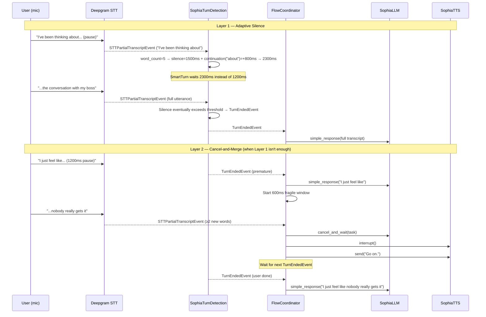

# feat: Adaptive Turn Detection + Cancel-and-Merge + Rhythm Learning

## Overview

Replace the fixed 1200ms silence-based turn detection with a three-layer system: (1) adaptive silence thresholds scaled by utterance length and continuation signals, (2) a cancel-and-merge recovery path when Sophia misfires, and (3) per-user rhythm learning over time. The goal is to make Sophia wait for complete thoughts before responding, recover gracefully when she jumps in too early, and learn each user's speaking pace.

## Problem Frame

Sophia's voice conversations feel choppy. When a user pauses mid-thought (2–3 seconds to breathe, think, or transition between clauses), SmartTurn fires a TurnEndedEvent on the silence gap. Sophia replies to half the thought. The user then continues, creating a second fragmented exchange.

Current state: `SophiaTurnDetection` inherits from SmartTurn v3 which fires when `trailing_silence_ms > _trailing_silence_ms` (hardcoded at 2000ms internally) AND the Smart Turn ONNX model predicts turn completion (>0.5). SmartTurn is audio-only — it has no access to the transcript. There is no recovery path once a turn fires. (see origin: docs/brainstorms/2026-03-31-conversational-flow-requirements.md)

## Requirements Trace

- R1. Silence threshold scales with transcript word count (1–3w → 1000ms, 4–10w → 1500ms, 11+w → 2000ms)
- R2. Continuation signal detection extends threshold by 800ms (conjunctions, fillers, incomplete clauses, trailing articles)
- R3. Adaptive threshold ceiling: 2800ms
- R4. All threshold adjustments logged at DEBUG
- R5. 600ms fragile window after LLM stream starts — monitor for new user speech
- R6. New speech = Deepgram emits interim transcript with ≥2 new words
- R7. Cancel-and-merge sequence: abort LLM, stop TTS, say acknowledgment, wait for complete thought, resubmit merged transcript
- R8. No fragile-window overhead when user doesn't continue (zero-latency normal path)
- R9. Rotating acknowledgment phrase pool, no consecutive repeats
- R10. Merged transcript submitted as single turn; LLM never sees aborted partial
- R11. Discarded words not injected into conversation context
- R12. Cancel-and-merge fires at most once per user turn
- R13. Track per-user speech metrics across sessions
- R14. After ≥5 sessions, adjust adaptive silence baseline from learned metrics
- R15. Rhythm data in `users/{user_id}/rhythm.json`, not Mem0
- R16. Rhythm bounds: 800ms min, 2400ms max base
- R17. New users fall back to R1 word-count heuristic

## Scope Boundaries

- No changes to Deepgram STT configuration (endpointing params)
- No changes to the backend middleware chain or prompt content
- No semantic completeness detection via LLM (too slow)
- No barge-in behavior changes (user interrupting Sophia is handled separately by the Agent framework)
- English-only continuation signals
- Acknowledgment phrases not emotion-aware in v1 (deferred enhancement)

## Context & Research

### Relevant Code and Patterns

- `voice/sophia_turn.py` — `SophiaTurnDetection`, echo guard subclass of SmartTurn. Primary target for Layer 1.
- `voice/.venv/.../plugins/smart_turn/smart_turn_detection.py` — SmartTurn v3 uses `_trailing_silence_ms` (instance var, default 2000) and `_predict_turn_completed()` ONNX model. The silence check is `trailing_silence_ms > self._trailing_silence_ms`. This value is mutable at runtime.
- `voice/sophia_llm.py` — `SophiaLLM.simple_response()` → `_stream_backend()`. The response is an asyncio task managed by Agent's `_pending_turn.task`.
- `voice/sophia_tts.py` — `SophiaTTS.stream_audio()` generates via `self.client.tts.generate()`. The base `CartesiaTTS` has an `interrupt()` method inherited from `TTS` base.
- `voice/server.py` — Wires Agent with STT, TTS, LLM, TurnDetection. `attach_runtime_observers` subscribes to events.
- `voice/.venv/.../core/agents/agents.py` — Agent framework:
  - `_on_turn_started` handles barge-in: calls `tts.interrupt()` + clears `_streaming_tts_buffer`
  - `_on_turn_ended` reads transcript from `TranscriptBuffer`, creates `asyncio.Task` with `simple_response()`
  - `_pending_turn` tracks active LLM task; `cancel_and_wait()` can cancel it
  - `streaming_tts=True` sends text to TTS at sentence boundaries via `LLMResponseChunkEvent`
- `voice/.venv/.../core/stt/events.py` — `STTPartialTranscriptEvent` (interim), `STTTranscriptEvent` (final). Both carry `text: str`.
- `voice/.venv/.../core/agents/transcript/buffer.py` — `TranscriptBuffer` accumulates segments from STT events.
- `voice/.venv/.../core/utils/utils.py` — `cancel_and_wait()` for safely cancelling asyncio tasks.
- `voice/config.py` — `VoiceSettings` dataclass with SmartTurn params. Pattern: `_env_int()` / `_env_float()` helpers.
- `voice/tests/` — 10 test files, 55 tests total. Pattern: `pytest` with `unittest.mock.AsyncMock`, direct class instantiation.

### External References

- SmartTurn v3 documentation: audio-only model, does NOT understand what is said, only prosodic/spectral features. Turn completion prediction runs in ~12ms on CPU.
- Deepgram interim transcripts: arrived via WebSocket `channel.alternatives[0].transcript` with `is_final=false`. Typical latency 200–300ms.

## Key Technical Decisions

- **Modify `_trailing_silence_ms` at runtime, not fork SmartTurn**: SmartTurn's `_trailing_silence_ms` is a mutable instance variable. We can adjust it before each silence evaluation. This avoids forking the upstream class and keeps us compatible with SmartTurn updates. (Trade-off: we're coupling to an internal field name; mitigated by pinned package version and a compatibility guard.)
- **Pipe STT partials into TurnDetection**: SmartTurn is audio-only. To get transcript content for word count and continuation signals, we subscribe `SophiaTurnDetection` to `STTPartialTranscriptEvent` from the Agent's event bus. This is a new dependency.
- **ConversationFlowCoordinator as an external orchestrator, not Agent subclass**: Creating a coordinator object that subscribes to Agent events and controls the cancel-and-merge flow. This avoids subclassing Agent (which would be fragile) and keeps the logic testable in isolation.
- **Cancel approach: `cancel_and_wait()` + `tts.interrupt()`**: The Agent framework already uses this pattern for barge-in. We reuse it. The LLM async task is cancelled; TTS playback is interrupted. The coordinator then synthesizes an acknowledgment phrase and waits for the next TurnEndedEvent.
- **Acknowledgment via TTS, not pre-recorded clips**: Uses the existing TTS pipeline with warm-default emotion. More natural and consistent with Sophia's voice. Pre-recorded clips would require managing audio files.
- **Rhythm file-based, not Mem0**: Rhythm data is operational tuning (pause durations, frequencies), not user memory. Different lifecycle, different access pattern. Simple JSON file under `users/{user_id}/rhythm.json`.
- **Environment-variable overrides for all tunables**: All thresholds, window durations, and bounds are configurable via env vars with sensible defaults. Enables rapid tuning without code changes.

## Open Questions

### Resolved During Planning

- **Q1: TTS cancel API?** — YES. `TTS.interrupt()` exists in the base class, already used for barge-in in `Agent._on_turn_started`. `CartesiaTTS` inherits it. No additional SDK work needed.
- **Q2: Deepgram interim transcript speed?** — YES. `STTPartialTranscriptEvent` fires during recognition at ~200–300ms latency. Well within the 600ms fragile window. The event carries `text: str`.
- **Q3: Emotion-aware acknowledgments?** — Deferred. V1 uses warm default emotion ("content" / "gentle"). Emotion-aware selection is a v2 enhancement once the tone band is reliably available during cancel-merge.
- **How does SmartTurn use silence internally?** — `_trailing_silence_ms` (default 2000) is compared against computed trailing silence. When `long_silence` triggers, SmartTurn THEN runs the ONNX model. So modifying `_trailing_silence_ms` gates when the model even gets a chance to evaluate. This is the right lever.
- **Does the Agent already handle cancellation?** — Yes. `_on_turn_started` cancels TTS on barge-in. `_on_turn_ended` can cancel a pending LLM task via `cancel_and_wait()` when the transcript changes. We model cancel-and-merge similarly.

### Deferred to Implementation

- **Exact DTX correction factor**: SmartTurn multiplies silence chunks by `* 5` ("DTX correction"). The interaction between this factor and our adaptive threshold needs tuning during testing.
- **Race conditions in fragile window**: The coordinator monitors STT events during a 600ms window while the LLM is streaming. The exact ordering of asyncio events may require a brief settling delay. Validate with real-world sessions.
- **Rhythm JSON schema evolution**: If we add new metrics later, the schema needs backward-compatible loading. V1 uses a flat schema; future versions may add fields.

## High-Level Technical Design

> *This illustrates the intended approach and is directional guidance for review, not implementation specification. The implementing agent should treat it as context, not code to reproduce.*



## Implementation Units

- [ ] **Unit 1: Adaptive Silence Threshold in SophiaTurnDetection**

**Goal:** Make the silence threshold dynamic based on transcript word count.

**Requirements:** R1, R3, R4

**Dependencies:** None

**Files:**
- Modify: `voice/sophia_turn.py`
- Modify: `voice/config.py`
- Test: `voice/tests/test_sophia_turn.py`

**Approach:**
- Add `_current_transcript_text: str` and `_adaptive_silence_ms: int` fields to `SophiaTurnDetection`.
- Add `update_transcript(text: str)` method that computes the adaptive silence based on word count:
  - 1–3 words → base 1000ms
  - 4–10 words → base 1500ms
  - 11+ words → base 2000ms
- Before SmartTurn's `_process_audio_packet` comparison, override `_trailing_silence_ms` with the computed value. Use a compatibility guard: check that `_trailing_silence_ms` attribute exists on the base class before modifying it.
- Cap at 2800ms (from R3). Apply rhythm adjustment (from Layer 3) as additive offset on the base.
- Add new config params to `VoiceSettings`: `adaptive_silence_short_ms`, `adaptive_silence_medium_ms`, `adaptive_silence_long_ms`, `adaptive_silence_ceiling_ms` with defaults 1000, 1500, 2000, 2800.
- Log at DEBUG: word count, computed silence, reason.
- Reset `_current_transcript_text = ""` when a turn ends (after TurnEndedEvent fires).

**Patterns to follow:**
- Echo guard pattern in existing `SophiaTurnDetection` (method calls from external, state on instance)
- Config pattern in `voice/config.py` (`_env_int()` helpers, `VoiceSettings` dataclass fields)

**Test scenarios:**
- Happy path: `update_transcript("yes")` → `_trailing_silence_ms` becomes 1000
- Happy path: `update_transcript("I think the meeting went well")` → 1500 (7 words)
- Happy path: `update_transcript("I think the meeting went well and I'm happy about")` → 2000 (11+ words)
- Edge case: empty transcript → defaults to 1000 (treat as short confirmation)
- Edge case: exactly 3 words → 1000; exactly 4 words → 1500; exactly 11 words → 2000
- Edge case: ceiling enforcement — even with continuation extension, does not exceed 2800
- Integration: `update_transcript()` overwrites `_trailing_silence_ms` on the base class; compatible with `process_audio` flow

**Verification:**
- `_trailing_silence_ms` dynamically reflects word count of the current partial transcript
- DEBUG logs show computed values and the reason string
- All existing echo guard tests still pass (no regression)

---

- [ ] **Unit 2: Continuation Signal Detection**

**Goal:** Detect trailing continuation patterns (conjunctions, fillers, incomplete clauses) and extend the silence threshold by 800ms.

**Requirements:** R2, R3, R4

**Dependencies:** Unit 1

**Files:**
- Modify: `voice/sophia_turn.py`
- Modify: `voice/config.py`
- Test: `voice/tests/test_sophia_turn.py`

**Approach:**
- Add `CONTINUATION_PATTERNS` — compiled regex patterns that match continuation signals in the trailing 1–3 words of a transcript. Patterns:
  - Conjunctions: `and`, `but`, `because`, `so`, `or`, `although`, `though`
  - Fillers: `um`, `uh`, `like`, `you know`, `I mean`, `basically`, `actually`
  - Incomplete clauses: `I was`, `I think`, `it's like`, `the thing is`
  - Trailing prepositions/articles: `to`, `for`, `with`, `the`, `a`
- Add `_has_continuation_signal(text: str) -> bool` method that checks the last N words against these patterns.
- In `update_transcript()`, after computing word-count base, check for continuation signal and add 800ms (configurable via `adaptive_silence_continuation_bonus_ms`).
- Still respect 2800ms ceiling after bonus.

**Patterns to follow:**
- `_EMOTION_HINT_RULES` pattern in `sophia_tts.py` (pre-compiled regex list)

**Test scenarios:**
- Happy path: "I was thinking about and" → continuation detected ("and"), +800ms
- Happy path: "I feel like um" → continuation detected ("um"), +800ms
- Happy path: "The thing is" → continuation detected, +800ms
- Happy path: "It happened because" → continuation detected ("because"), +800ms
- Edge case: "I finally understand" → no continuation signal, no bonus
- Edge case: "I and we" → "we" is the trailing word, no continuation (only trailing position matters)
- Edge case: word-count 11+ (2000ms) + continuation (+800ms) = 2800ms (at ceiling)
- Edge case: word-count 11+ (2000ms) + continuation (+800ms) capped at 2800ms (not 2800+)
- Edge case: case-insensitive matching ("AND", "Um", "BECAUSE")
- Integration: full `update_transcript` → `_trailing_silence_ms` reflects base + bonus

**Verification:**
- 800ms bonus applied only when trailing words match continuation patterns
- Ceiling of 2800ms is never exceeded
- Log output includes "continuation=and" or similar

---

- [ ] **Unit 3: STT-to-TurnDetection Wiring**

**Goal:** Pipe Deepgram partial transcripts into `SophiaTurnDetection` so it can compute adaptive silence in real time.

**Requirements:** R1, R2

**Dependencies:** Unit 1

**Files:**
- Modify: `voice/server.py`
- Test: `voice/tests/test_sophia_turn.py`

**Approach:**
- In `server.py`'s `attach_runtime_observers`, subscribe to `STTPartialTranscriptEvent` from `agent.stt.events`.
- On each partial transcript event, call `turn_detection.update_transcript(event.text)`.
- Also subscribe to `STTTranscriptEvent` (final) for the same update (some STT flows skip partials on fast speech).
- On `TurnEndedEvent`, reset the transcript state in turn detection.

**Patterns to follow:**
- Existing `attach_runtime_observers` in `server.py` (subscribes to events, calls methods on LLM)

**Test scenarios:**
- Happy path: mock STT emitting partial events → `update_transcript` called with correct text
- Happy path: TurnEndedEvent → transcript state reset
- Edge case: STTTranscriptEvent (final) also triggers `update_transcript` — covers fast-speech scenario

**Verification:**
- Partial transcripts flow from STT to TurnDetection in real-time
- Turn detection's adaptive silence reflects the latest transcript

---

- [ ] **Unit 4: ConversationFlowCoordinator — Fragile Window + Cancel**

**Goal:** Detect when the user continues speaking after Sophia starts responding, cancel the in-flight response, and prepare for re-submission.

**Requirements:** R5, R6, R7, R8, R11, R12

**Dependencies:** Unit 3

**Files:**
- Create: `voice/conversation_flow.py`
- Modify: `voice/config.py`
- Test: `voice/tests/test_conversation_flow.py`

**Approach:**
- New class `ConversationFlowCoordinator` with these methods:
  - `on_turn_ended(transcript, participant)` — called by the Agent when a turn ends. Stores the original transcript and starts a fragile window timer.
  - `on_partial_transcript(text)` — called during the fragile window. Compares new text against the stored transcript. If ≥2 new words differ, triggers cancel-and-merge.
  - `on_fragile_window_expired()` — timer callback. If no new speech, does nothing (zero overhead per R8).
  - `cancel_active_response()` — cancels the LLM task via a callback, calls `tts.interrupt()`.
  - `on_merge_turn_ended(transcript)` — called when the user finishes their continued thought. Merges original + continuation and resubmits.
- Fields: `_fragile_window_task`, `_original_transcript`, `_merge_pending`, `_cancel_count` (for R12 once-per-turn guard), `_last_ack_index` (for R9 no-repeat).
- Config: `fragile_window_ms` (default 600), `merge_min_new_words` (default 2).
- The coordinator does NOT subclass Agent. It receives callbacks for `cancel_llm_task`, `interrupt_tts`, `send_acknowledgment`, and `resubmit_response`.
- R8 guarantee: the fragile window is a lightweight asyncio timer. If it expires without detecting new speech, nothing happens. No blocking, no latency added.
- R12 guarantee: `_cancel_count` incremented on each cancel. If already 1, subsequent detections trigger only Layer 1 adaptive waiting.

**Patterns to follow:**
- `PendingTurnMetrics` pattern in `sophia_llm.py` (per-turn state tracking with cleanup)
- Echo guard pattern in `sophia_turn.py` (method-based state transitions)

**Test scenarios:**
- Happy path: turn ends → fragile window starts → no new speech → window expires → no cancel (R8)
- Happy path: turn ends → fragile window starts → new speech (≥2 words) → cancel triggered
- Happy path: cancel sequence fires in order: cancel LLM → interrupt TTS → send ack → wait for next turn
- Edge case: new speech has only 1 new word → below threshold → no cancel
- Edge case: cancel-and-merge already fired once → second new speech detected → no second cancel (R12)
- Edge case: fragile window expires before partial transcript arrives → normal flow continues
- Error path: cancel_llm_task raises → coordinator logs error and continues gracefully
- Integration: merged transcript = original + " " + continuation

**Verification:**
- Fragile window adds zero latency to normal turns (no new speech detected)
- Cancel-and-merge fires exactly once per turn
- Merged transcript is a clean concatenation of original + continuation

---

- [ ] **Unit 5: Acknowledgment Phrase Pool**

**Goal:** When cancel-and-merge fires, Sophia says a brief verbal acknowledgment ("Go on.", "Mm-hmm.", etc.) while waiting for the user to finish.

**Requirements:** R9

**Dependencies:** Unit 4

**Files:**
- Modify: `voice/conversation_flow.py`
- Test: `voice/tests/test_conversation_flow.py`

**Approach:**
- Add `ACKNOWLEDGMENT_PHRASES` list to `conversation_flow.py`: "Go on.", "Mm-hmm.", "Sorry, continue.", "I'm listening.", "Take your time."
- Add `_pick_acknowledgment() -> str` method that cycles through the pool, never repeating the same phrase consecutively. Track `_last_ack_index`.
- The coordinator calls `send_acknowledgment(phrase)` callback, which routes to `tts.send(phrase)` (or `tts.stream_audio(phrase)` depending on the TTS interface).
- The phrase should use warm-default emotion (content/gentle). Not emotion-aware in v1.

**Test scenarios:**
- Happy path: first acknowledgment returns a valid phrase from the pool
- Happy path: calling `_pick_acknowledgment()` twice in a row never returns the same phrase
- Edge case: after cycling through all phrases, wraps around without repeating the last one
- Edge case: pool size of 1 → always returns that phrase (degenerate case, still valid)

**Verification:**
- No consecutive duplicate acknowledgments across multiple cancel-merge events in a session
- Phrases come from the configured pool

---

- [ ] **Unit 6: Coordinator Wiring in server.py**

**Goal:** Wire `ConversationFlowCoordinator` into the Agent's event flow so it receives events and can control LLM/TTS.

**Requirements:** R5, R6, R7, R10

**Dependencies:** Unit 4, Unit 5

**Files:**
- Modify: `voice/server.py`
- Test: `voice/tests/test_conversation_flow.py`

**Approach:**
- In `create_agent()`, instantiate `ConversationFlowCoordinator` with callbacks:
  - `cancel_llm_task` → cancels `Agent._pending_turn.task` (needs access to the Agent instance or a cancel callback)
  - `interrupt_tts` → `tts.interrupt()`
  - `send_ack` → `tts.send(phrase)` (voice the acknowledgment)
  - `resubmit` → calls `agent.simple_response(merged_transcript, participant)` (or equivalent)
- In `attach_runtime_observers`, subscribe coordinator to:
  - `STTPartialTranscriptEvent` → `coordinator.on_partial_transcript(event.text)`
  - `TurnEndedEvent` → `coordinator.on_turn_ended(transcript, event.participant)`
- The coordinator needs to intercept the normal Agent flow. Two approaches:
  - **Option A:** Override `Agent.simple_response()` to route through the coordinator
  - **Option B:** Subscribe coordinator to Agent events and handle cancel/resubmit externally
- Choose Option A: subclass or monkey-patch `simple_response` is fragile. Instead, use a **pre-response hook**: the coordinator decides whether to allow the LLM call or hold it. But this conflicts with the Agent's internal `_on_turn_ended` which fires `simple_response` automatically.
- **Revised approach:** Override `Agent.simple_response()` in a `SophiaAgent` subclass that wraps the flow through the coordinator. This is the cleanest extension point documented by the SDK ("Overwrite simple_response if you want to change how the Agent class calls the LLM").

**Patterns to follow:**
- `attach_runtime_observers` in `server.py` (event subscription pattern)
- Agent SDK: `simple_response` is explicitly documented as an override point

**Test scenarios:**
- Integration: turn ends → coordinator receives event → fragile window starts → normal response proceeds after window expires
- Integration: turn ends → new speech during window → cancel fires → ack spoken → merged resubmit
- Integration: TTS interrupt called → echo guard updated (no false VAD triggers from ack)
- Error path: coordinator fails to cancel → LLM response continues (graceful degradation)

**Verification:**
- Full event flow from TurnEndedEvent through coordinator to LLM response works end-to-end
- Merged resubmit uses the complete transcript
- Acknowledgment is audible before the merged response

---

- [ ] **Unit 7: RhythmTracker — Metrics Collection + Storage**

**Goal:** Track per-user speech metrics and store them for future session adaptation.

**Requirements:** R13, R14, R15, R16, R17

**Dependencies:** Unit 1 (uses adaptive silence base it adjusts)

**Files:**
- Create: `voice/rhythm.py`
- Modify: `voice/config.py`
- Test: `voice/tests/test_rhythm.py`

**Approach:**
- New class `RhythmTracker`:
  - `load(user_id: str) -> RhythmData | None` — reads `users/{user_id}/rhythm.json`. Returns None if file doesn't exist (new user → R17).
  - `record_turn(word_count: int, pause_durations: list[float], was_cancel_merge: bool)` — accumulates session metrics.
  - `end_session()` — writes updated metrics back to the file. Increments `session_count`.
  - `compute_silence_offset() -> int` — returns ms offset to add to Layer 1 base. Positive for slow speakers, negative for fast speakers. Bounded by R16 (total base: 800ms min, 2400ms max).
- `RhythmData` schema (JSON):
  ```
  { "session_count": int,
    "avg_pause_ms": float,
    "avg_words_per_turn": float,
    "multi_clause_frequency": float,
    "cancel_merge_frequency": float,
    "last_updated": "ISO8601" }
  ```
- The offset formula: compare user's `avg_pause_ms` against population default (1200ms). If user pauses longer, increase base. If shorter, decrease.
- Ensure `users/` directory is created if it doesn't exist (use `Path.mkdir(parents=True, exist_ok=True)`).
- Config: `rhythm_min_sessions` (default 5), `rhythm_base_min_ms` (default 800), `rhythm_base_max_ms` (default 2400).

**Patterns to follow:**
- File-based user data pattern: `users/{user_id}/handoffs/latest.md` from the spec
- `VoiceSettings` pattern for config params

**Test scenarios:**
- Happy path: new user (no file) → `load()` returns None → R17 default behavior
- Happy path: existing user with 5+ sessions → `compute_silence_offset()` returns non-zero value
- Happy path: user with long pauses → positive offset (higher silence threshold)
- Happy path: user with short, snappy turns → negative offset (lower threshold)
- Edge case: user with exactly 5 sessions → learning activates
- Edge case: user with 4 sessions → learning NOT active, returns 0 offset
- Edge case: offset computation respects bounds (800ms min, 2400ms max total)
- Edge case: corrupt or malformed JSON → `load()` returns None with warning log
- Happy path: `end_session()` writes valid JSON, `last_updated` reflects current time
- Integration: `record_turn()` updates running averages correctly over multiple turns

**Verification:**
- Rhythm file created on first `end_session()` for a new user
- Offset is 0 for users with < 5 sessions
- Offset is bounded between min and max regardless of extreme metric values

---

- [ ] **Unit 8: Rhythm Integration into Adaptive Silence**

**Goal:** Wire RhythmTracker's offset into SophiaTurnDetection's adaptive silence computation.

**Requirements:** R14, R16

**Dependencies:** Unit 1, Unit 7

**Files:**
- Modify: `voice/sophia_turn.py`
- Modify: `voice/server.py`
- Test: `voice/tests/test_sophia_turn.py`

**Approach:**
- Add `set_rhythm_offset(offset_ms: int)` to `SophiaTurnDetection`. Stores the offset for the session.
- In `update_transcript()`, the adaptive silence formula becomes: `base + continuation_bonus + rhythm_offset`, capped at ceiling.
- In `server.py`, during `create_agent()`:
  - Load user's rhythm data
  - If available and sufficient sessions, compute offset and set it on turn detection
- At session end (disconnect / idle timeout), call `rhythm_tracker.end_session()` to persist.

**Test scenarios:**
- Happy path: rhythm offset +200ms → word-count base 1500ms → effective silence 1700ms
- Happy path: rhythm offset -200ms → word-count base 1500ms → effective silence 1300ms
- Edge case: rhythm offset would push below 800ms floor → clamped to 800ms
- Edge case: rhythm offset + continuation bonus would push above 2800ms ceiling → clamped to 2800ms
- Edge case: no rhythm data → offset is 0, pure word-count behavior

**Verification:**
- Adaptive silence reflects both word-count heuristic and per-user rhythm adjustment
- Floor and ceiling bounds are always respected

## System-Wide Impact

- **Interaction graph:** `SophiaTurnDetection` now receives STT events (new dependency). `ConversationFlowCoordinator` subscribes to TurnEndedEvent + STTPartialTranscriptEvent and controls LLM task lifecycle + TTS interrupt. `RhythmTracker` reads/writes `users/` directory.
- **Error propagation:** Coordinator failures degrade gracefully — if cancel fails, the response continues normally. If rhythm file is unreadable, defaults apply. No new fatal error paths.
- **State lifecycle risks:** The fragile window timer is an asyncio task. If the Agent disconnects mid-window, the task should be cancelled in cleanup. The coordinator needs to subscribe to disconnect/cleanup events. Rhythm file writes are atomic (write-then-rename) to prevent corruption on crash.
- **API surface parity:** No API surface changes. This is entirely within the voice server layer.
- **Integration coverage:** The cancel-and-merge flow spans STT → Coordinator → LLM → TTS and must be tested with the full Agent event flow, not just unit-level mocks.
- **Unchanged invariants:** Echo guard behavior in SophiaTurnDetection is preserved. The existing barge-in handler in the Agent framework is unchanged. Backend middleware chain and prompt content are untouched.

## Risks & Dependencies

| Risk | Mitigation |
|------|------------|
| Modifying SmartTurn's `_trailing_silence_ms` breaks on SDK update | Pin vision_agents version. Add compatibility guard that checks attribute exists before setting. Log warning if missing. |
| Fragile window timer races with Agent's internal `_on_turn_ended` | The coordinator wraps or intercepts `simple_response` — it controls the timing. If the Agent fires first, coordinator catches up. |
| Acknowledgment phrase causes echo guard to fire (Sophia hearing herself) | Call `note_agent_will_speak()` before sending acknowledgment, same as regular TTS. |
| Rhythm file I/O blocks the event loop | Use `asyncio.to_thread()` for all file reads/writes. |
| User speaks very slowly (5+ second pauses) — ceiling of 2800ms still fires | This is by design. 2800ms is already generous. Beyond that, the cancel-and-merge recovery handles it. |
| Cancel-and-merge interrupts a response the user actually wanted | The acknowledgment ("Go on.") gives the user a signal. If they say nothing more, the response is lost and they can repeat. This is rare (only during fragile window + new speech). |

## Sources & References

- **Origin document:** [docs/brainstorms/2026-03-31-conversational-flow-requirements.md](docs/brainstorms/2026-03-31-conversational-flow-requirements.md)
- Related code: `voice/sophia_turn.py`, `voice/sophia_llm.py`, `voice/sophia_tts.py`, `voice/server.py`
- SDK internals: `vision_agents.plugins.smart_turn.smart_turn_detection.SmartTurnDetection._trailing_silence_ms`
- SDK extension point: `vision_agents.core.agents.agents.Agent.simple_response()` (documented override)
- SmartTurn v3: https://github.com/pipecat-ai/smart-turn/tree/main
