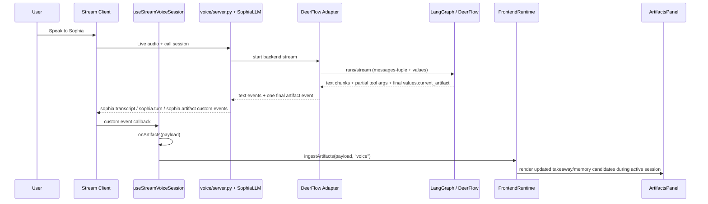

# Restore Live Voice Artifact Pipeline

## Overview

Restore end-to-end live artifact delivery for Sophia voice conversations so completed turn artifacts reliably reach the MVP frontend during an active session and render in the artifacts panel without waiting for recap or session exit.

The existing frontend artifact path is already in place and tested. The plan therefore focuses on the live voice transport contract: how the DeerFlow adapter identifies the authoritative artifact, how `SophiaLLM` forwards that artifact into Stream custom events, and how the backend contract is validated so a turn only fails when no final artifact exists at all.

Execution posture: characterization-first. Preserve the current frontend artifact ownership and text/chat artifact flow while fixing only the live voice transport seams.

## Problem Frame

The origin audit found a split-brain artifact system. Chat/text flows already normalize and deliver artifacts through structured `data-artifactsV1` events, and the shared runtime in `AI-companion-mvp-front` is capable of merging and rendering them. Live voice, however, still depends on a transport contract that is incomplete and internally inconsistent.

On the backend side, `voice/adapters/deerflow.py` still treats streamed `emit_artifact` tool-call args as authoritative, even though Anthropic-style chunking can produce partial or empty args mid-stream. The stronger signal is the completed artifact in final run state (`values.current_artifact`). At the same time, `voice/sophia_llm.py` supports a `call_emitter` hook for forwarding `sophia.artifact`, `sophia.transcript`, and `sophia.turn`, but `voice/server.py` never wires that hook into agent startup. The frontend therefore waits for events that the live server does not reliably emit.

Targeted verification already shows the two sides pass in isolation:

- Voice-side artifact tests passed: `voice/tests/test_deerflow_adapter.py`, `voice/tests/test_sophia_llm_streaming.py`, and `voice/tests/test_shim_adapter.py` (`18` tests total).
- Frontend artifact tests passed: `AI-companion-mvp-front/src/__tests__/hooks/useStreamVoiceSession.test.ts`, `AI-companion-mvp-front/src/__tests__/session/stream-contract-adapters.test.ts`, `AI-companion-mvp-front/src/__tests__/companion-runtime/stream-contract.test.ts`, `AI-companion-mvp-front/src/__tests__/chat/chat-voice-artifacts.test.ts`, `AI-companion-mvp-front/src/__tests__/api/chat/stream-transformers.test.ts`, `AI-companion-mvp-front/src/__tests__/session/useSessionRouteExperience.test.ts`, and `AI-companion-mvp-front/src/__tests__/session/useSessionInterruptOrchestration.test.ts` (`38` tests total).

That combination strongly suggests the failure is not the artifact panel UI. It is the live voice transport contract between DeerFlow, `SophiaLLM`, Stream custom events, and the frontend voice session hook.

## Requirements Trace

- R1, R10-R12: Wire the live custom-event bridge and make the backend emit the event contract the frontend already consumes.
- R2-R5: Use one authoritative live artifact source, tolerate partial streamed tool args, and only fail when no final artifact exists.
- R6-R9: Preserve the frontend’s event-driven artifact ownership and ensure the artifacts panel updates during active voice conversation.
- R13-R16: Add backend integration coverage and one higher-level smoke path that distinguishes missing artifact generation, missing forwarding, and missing rendering.

## Scope Boundaries

- In scope: `voice/` live artifact transport, event forwarding, authoritative artifact source selection, and focused frontend verification of the existing artifact runtime.
- In scope: deciding and enforcing whether `sophia.transcript` and `sophia.turn` are part of the supported live contract.
- Out of scope: redesigning `ArtifactsPanel`, recap UX, memory review UX, or the 13-field artifact schema.
- Out of scope: offline pipeline, Journal artifacts, or broader Mem0 review flows.
- Out of scope: replacing the shared `AI-companion-mvp-front` artifact runtime with route-local logic.

## Context And Research

### Relevant Code And Patterns

- `voice/adapters/deerflow.py` is the live voice adapter that currently parses streamed text/tool events and decides when to emit `BackendEvent.artifact_payload(...)`.
- `voice/sophia_llm.py` is the transport edge between backend events and client delivery. It already supports `attach_call_emitter(...)` and emits `sophia.artifact`, `sophia.transcript`, and `sophia.turn` when a call emitter exists.
- `voice/server.py` creates the agent and currently wires turn/STT observers, but not the `SophiaLLM` call emitter.
- `AI-companion-mvp-front/src/app/hooks/useStreamVoiceSession.ts` is the live voice frontend hook. It already listens for `sophia.artifact`, `sophia.transcript`, and `sophia.turn` custom events and forwards artifact payloads into the route runtime.
- `AI-companion-mvp-front/src/app/companion-runtime/stream-contract.ts` and `AI-companion-mvp-front/src/app/companion-runtime/artifacts-runtime.ts` are the canonical frontend ownership seams for stream normalization and artifact persistence.
- `AI-companion-mvp-front/src/app/session/useSessionRouteExperience.ts` and `AI-companion-mvp-front/src/app/chat/chat-voice-artifacts.ts` already prove that route pages are no longer the right place to own artifact normalization.
- `AI-companion-mvp-front/src/app/api/chat/_lib/stream-transformers.ts` is the existing text/chat precedent for structured artifact delivery. The voice fix should follow its ownership model, not invent a separate UI path.

### Institutional Learnings

- `docs/solutions/integration-issues/sophia-voice-fragmented-turns-2026-04-01.md` shows that live voice regressions in this repo often look like UI or session leaks when the real fault is an async transport seam. The lesson is to fix the transport contract first and only then revisit UI assumptions.
- Repo memory confirms two artifact-specific findings that shape this plan:
  - In this LangGraph local stack, raw `messages-tuple` payloads arrive as JSON lists and need normalization before `.get()` access.
  - Anthropic streaming can surface partial or empty `tool_calls[].args`; the reliable completed artifact appears in `values.current_artifact`.
- Repo memory also confirms the current MVP frontend artifact path is already canonical and that when live artifacts do not show up in-session, the first place to look is the voice transport contract rather than `ArtifactsPanel` or route UI code.

### External Research Decision

Skipped. The repo already contains the relevant local evidence, tests, and transport abstractions. The problem is integration consistency, not missing framework guidance.

## Resolved During Planning

- **Authoritative live artifact source:** Prefer final run state (`values.current_artifact`) when available. Streamed `tool_calls[].args` remain a provisional hint, not the final source of truth.
- **Transcript/turn contract choice:** Keep `sophia.transcript` and `sophia.turn` in the supported live contract. The frontend already consumes them, and emitting them from the backend is a smaller and safer change than rewriting the live voice runtime to stop expecting them.
- **Emitter integration seam:** Wire the custom-event emitter during live agent startup in `voice/server.py`, at the same point `SophiaLLM` is created and attached to TTS. This keeps event transport owned by the live server layer rather than the adapter.
- **Higher-level verification strategy:** Use a backend integration harness with a fake call emitter and controlled adapter stream as the primary smoke path. Keep the existing frontend hook tests as the renderer-side proof rather than depending on a browser-only smoke test.

## Deferred To Implementation

- Exact helper names and whether the final-state artifact reading logic belongs in a dedicated adapter helper or a small inline state collector inside `stream_events(...)`.
- Whether the adapter should emit a diagnostic backend event for “streamed args malformed but final values recovered” or keep that distinction only in logs/tests.
- Whether the higher-level backend smoke path is best added to an existing `voice/tests/test_sophia_llm_streaming.py` harness or split into a new `voice/tests/test_voice_artifact_contract.py` file.

## High-Level Technical Design

> This illustrates the intended approach and is directional guidance for review, not implementation specification. The implementing agent should treat it as context, not code to reproduce.

Decision matrix for artifact handling:

| Source observed during one turn | Final behavior |
|---|---|
| Partial streamed tool args only, no final values artifact | Keep buffering; fail only if turn completes with no parseable final artifact |
| Partial streamed tool args + final `values.current_artifact` | Use final-state artifact, emit once |
| Empty streamed tool args + final `values.current_artifact` | Ignore empty stream args, use final-state artifact |
| No streamed args + no final artifact | Raise backend-contract artifact failure |

## Implementation Units

- [ ] **Unit 1: Make the DeerFlow voice adapter final-state aware**

**Goal:** Update the live DeerFlow adapter so a completed artifact can be recovered from final run state and emitted exactly once, even when streamed tool-call args are partial or empty.

**Requirements:** R2, R3, R4, R5, R13, R16

**Dependencies:** None

**Files:**
- Modify: `voice/adapters/deerflow.py`
- Test: `voice/tests/test_deerflow_adapter.py`
- Test: `voice/tests/test_shim_adapter.py`

**Approach:**
- Extend the adapter stream request to include the final state mode needed to observe `current_artifact`.
- Normalize and buffer streamed artifact hints, but delay authoritative artifact emission until the final-state artifact decision can be made.
- Emit exactly one artifact event per turn.
- Treat malformed streamed args as non-fatal if a valid final artifact later appears in the same turn.
- Preserve text chunk streaming order and latency-sensitive text delivery while adding final-state artifact recovery.

**Patterns to follow:**
- `voice/adapters/deerflow.py` existing `stream_events(...)` normalization logic
- `voice/tests/test_deerflow_adapter.py` current coverage for `messages-tuple`, `tool_calls`, and malformed artifact payloads
- `voice/tests/test_shim_adapter.py` existing text-then-artifact event ordering expectation

**Test scenarios:**
- Happy path: stream text chunks, then recover final artifact from `values.current_artifact`, and emit one `artifact` backend event after text.
- Happy path: streamed tool-call args and final values both contain the same artifact; the adapter emits the artifact once.
- Edge case: streamed `tool_calls[].args` is empty, but final values contain a valid artifact; the turn succeeds and emits the final artifact.
- Edge case: streamed `tool_calls[].args` is partial JSON across chunks; final values contain a valid artifact; the adapter emits the final artifact once.
- Error path: streamed args malformed and no final values artifact exists; the adapter raises an artifact contract failure.
- Integration: mixed `messages-tuple` list payloads plus `values` payloads are normalized correctly and preserve text-before-artifact ordering.

**Verification:**
- A single adapter turn can produce text and one final artifact event even when streamed tool-call args are incomplete.
- Adapter tests explicitly distinguish “no artifact produced” from “stream artifact malformed but final artifact recovered.”

- [ ] **Unit 2: Wire the live custom-event bridge in the voice server**

**Goal:** Ensure the live voice server actually forwards transcript, turn, and artifact events from `SophiaLLM` to the Stream client during active sessions.

**Requirements:** R1, R6, R9, R10, R11, R12, R14

**Dependencies:** Unit 1

**Files:**
- Modify: `voice/server.py`
- Modify: `voice/sophia_llm.py`
- Test: `voice/tests/test_sophia_llm_streaming.py`
- Create or modify: `voice/tests/test_voice_artifact_contract.py`

**Approach:**
- Attach the call-emitter bridge during agent creation so `SophiaLLM` can emit custom events on the active call lifecycle.
- Keep `SophiaLLM` as the place that converts backend events into `sophia.transcript`, `sophia.turn`, and `sophia.artifact` messages.
- Confirm that transcript/turn events and artifact events share one supported live event contract.
- Avoid moving frontend-specific knowledge into the adapter; keep event emission in the live voice server layer.

**Patterns to follow:**
- `voice/sophia_llm.py` existing `attach_call_emitter(...)` and custom-event emission code
- `voice/server.py` existing agent-creation and runtime-observer wiring style
- `voice/tests/test_sophia_llm_streaming.py` current artifact forwarding test shape

**Test scenarios:**
- Happy path: server startup attaches a call emitter, and a completed artifact is emitted as `sophia.artifact` during one turn.
- Happy path: transcript text still streams before artifact emission.
- Edge case: transcript and turn events emit correctly even when no artifact is yet available mid-turn.
- Error path: no call emitter attached results in no forwarded event, and the test clearly captures that as a server-wiring failure.
- Integration: the live startup path wires `SophiaLLM` to the same event bridge used by the active Stream call, rather than a local fake-only path.

**Verification:**
- The live server startup path demonstrably wires the emitter hook used by `SophiaLLM`.
- A backend turn that yields a final artifact also yields a `sophia.artifact` client event.

- [ ] **Unit 3: Preserve the canonical frontend artifact runtime and prove the live contract**

**Goal:** Keep the existing frontend artifact ownership unchanged while adding one higher-level verification path that proves live voice artifacts reach the frontend contract.

**Requirements:** R6, R7, R8, R9, R15, R16

**Dependencies:** Unit 2

**Files:**
- Modify tests: `AI-companion-mvp-front/src/__tests__/hooks/useStreamVoiceSession.test.ts`
- Modify tests: `AI-companion-mvp-front/src/__tests__/session/useSessionRouteExperience.test.ts`
- Modify tests: `AI-companion-mvp-front/src/__tests__/companion-runtime/stream-contract.test.ts`
- Create or modify: `AI-companion-mvp-front/src/__tests__/architecture/live-voice-artifact-contract.test.ts`

**Approach:**
- Keep `useStreamVoiceSession`, `stream-contract`, `artifacts-runtime`, and route experiences as the only frontend artifact owners.
- Add one higher-level smoke path that simulates the real live contract shape the backend will emit, rather than only injecting arbitrary fake payloads.
- Make the test assertions distinguish three states: no artifact payload at all, artifact payload received but not ingested, and artifact payload ingested but not reflected in runtime state.

**Patterns to follow:**
- `AI-companion-mvp-front/src/app/hooks/useStreamVoiceSession.ts`
- `AI-companion-mvp-front/src/app/companion-runtime/stream-contract.ts`
- `AI-companion-mvp-front/src/app/companion-runtime/artifacts-runtime.ts`
- Existing frontend artifact tests under `AI-companion-mvp-front/src/__tests__/hooks/`, `src/__tests__/session/`, and `src/__tests__/companion-runtime/`

**Test scenarios:**
- Happy path: a `sophia.artifact` custom event carrying a valid artifact updates the live session runtime and artifact status during the active conversation.
- Happy path: text/chat artifact tests continue to pass unchanged after the live voice transport fix.
- Edge case: `sophia.artifact` arrives without a session identifier and falls back to the active route session id when appropriate.
- Error path: no artifact event arrives; the runtime remains in waiting state and the test distinguishes this from a rendering bug.
- Error path: malformed artifact event arrives; the runtime drops invalid known fields without crashing and records no false “complete” state.
- Integration: the route experience receives a payload shaped like the real live backend event contract and stores it without route-local parsing logic.

**Verification:**
- Frontend artifact ownership remains in the shared runtime and hook seams.
- At least one test proves the live voice contract shape reaches runtime ingestion, not just low-level parser helpers.

- [ ] **Unit 4: Add explicit transport diagnostics and contract docs**

**Goal:** Make artifact transport failures diagnosable and document the authoritative live artifact contract so the same split-brain state does not return.

**Requirements:** R12, R16

**Dependencies:** Units 1-3

**Files:**
- Modify: `voice/sophia_llm.py`
- Modify: `voice/adapters/deerflow.py`
- Modify: `AI-companion-mvp-front/FRONTEND_ARCHITECTURE.md`
- Modify: `docs/brainstorms/2026-04-01-artifact-pipeline-audit-requirements.md` (optional reference update after implementation)
- Create or modify: `docs/solutions/integration-issues/` artifact follow-up note if implementation discovers a reusable new learning

**Approach:**
- Add high-signal logging or debug diagnostics that distinguish: artifact never produced, artifact recovered from final values after malformed stream args, and artifact forwarded successfully.
- Update architecture docs to state one authoritative live artifact source and one live custom-event contract.
- Keep diagnostics in the transport/runtime layer rather than adding UI fallback heuristics.

**Patterns to follow:**
- `AI-companion-mvp-front/src/app/lib/debug-logger.ts`
- `voice/sophia_llm.py` existing timing/transport logging style
- `docs/MVP_FRONTEND_SURFACE_BOUNDARY.md` and other recent architecture docs for concise contract language

**Test scenarios:**
- Happy path: successful artifact forwarding logs the expected contract-success path without duplicate emissions.
- Edge case: streamed args malformed but final-state artifact recovered logs a recovery path, not a failure.
- Error path: turn completes with no final artifact logs the contract failure state explicitly.

**Verification:**
- Engineers can tell from logs whether a live artifact bug is generation, forwarding, or rendering.
- The documented contract matches the implemented source of truth and event flow.

## System-Wide Impact

- **Interaction graph:** `voice/adapters/deerflow.py` influences `voice/sophia_llm.py`, which influences Stream custom events, which feed `AI-companion-mvp-front/src/app/hooks/useStreamVoiceSession.ts`, which feeds `companion-runtime/artifacts-runtime.ts`, which feeds the artifacts panel. The fix must preserve that one chain rather than adding alternate ingestion paths.
- **Error propagation:** Artifact contract failures currently surface as backend-stage issues or silent frontend waiting states. After the fix, the system should clearly separate adapter recovery, forwarding failure, and render-time no-op.
- **State lifecycle risks:** If the adapter emits both provisional and final artifacts, duplicate artifact application becomes possible. The implementation must enforce exactly-once artifact emission per turn.
- **API surface parity:** Text/chat artifact delivery via `data-artifactsV1` must remain unchanged. The live voice fix should bring voice closer to the same ownership model, not diverge further.
- **Integration coverage:** Unit tests for adapter parsing and frontend ingestion are not enough by themselves. At least one backend integration harness and one higher-level frontend smoke path are needed to prove the contract.
- **Unchanged invariants:** The shared `AI-companion-mvp-front` artifact runtime remains canonical. `ArtifactsPanel` and recap mapping should not regain transport-parsing responsibility.

## Risks And Dependencies

| Risk | Mitigation |
|------|------------|
| Adding `values` handling regresses text streaming latency or ordering | Keep text chunk emission path unchanged and limit final-state artifact logic to turn-completion handling; verify text-before-artifact ordering in adapter tests |
| Backend emits duplicate artifacts when both streamed tool args and final values are present | Add exactly-once artifact emission tests and centralize artifact finalization in one adapter decision point |
| Frontend tests continue to pass while the live contract is still wrong | Add one higher-level live-voice contract smoke path that reflects backend event shape instead of only local helper payloads |
| Transcript/turn event expectations drift again | Make transcript/turn event emission an explicit supported contract in code and docs rather than an implied behavior |

## Documentation And Operational Notes

- Update the voice/frontend architecture notes so future work sees one authoritative live artifact source and one supported custom-event contract.
- If implementation uncovers a reusable transport lesson beyond the current brainstorm, add a follow-up `docs/solutions/` entry instead of leaving that knowledge only in the plan or code.

## Sources And References

- **Origin document:** [docs/brainstorms/2026-04-01-artifact-pipeline-audit-requirements.md](c:\Users\zerof\Sophia-Agent-X\docs\brainstorms\2026-04-01-artifact-pipeline-audit-requirements.md)
- Related code: `voice/adapters/deerflow.py`, `voice/sophia_llm.py`, `voice/server.py`, `AI-companion-mvp-front/src/app/hooks/useStreamVoiceSession.ts`, `AI-companion-mvp-front/src/app/companion-runtime/stream-contract.ts`, `AI-companion-mvp-front/src/app/companion-runtime/artifacts-runtime.ts`
- Related learning: [docs/solutions/integration-issues/sophia-voice-fragmented-turns-2026-04-01.md](c:\Users\zerof\Sophia-Agent-X\docs\solutions\integration-issues\sophia-voice-fragmented-turns-2026-04-01.md)