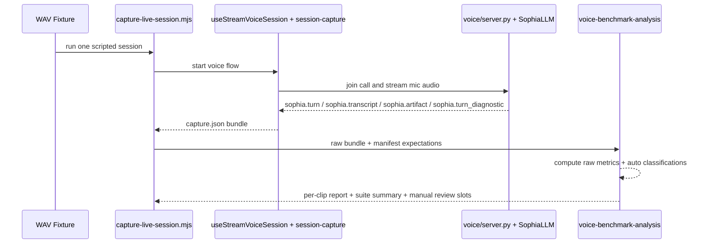

# fix: Stabilize live voice turn closure and calibrate emotion mapping

## Overview

Restore reliable, judgeable live voice conversations before doing any deep emotion retuning. The benchmark evidence is already clear: artifact delivery now works on successful turns, but turn finalization remains too unstable to support a fair evaluation of emotional delivery.

This plan therefore treats live voice as one integrated system with three coupled seams:

1. the WAV-driven benchmark contract and reporting path
2. the voice runtime's turn-close diagnostics and stability logic
3. the current-turn spoken-delivery resolver that should stay companion-safe even before the final artifact arrives

Execution posture: characterization-first. The first implementation units should make the current failures measurable and classifiable, then harden turn closure, and only then retune voice emotion behavior. Prompt-only mapping changes do not ship unless the benchmark rerun shows the stability gate still holds.

## Problem Frame

The origin document establishes the current baseline from five recent WAV-driven captures in `AI-companion-mvp-front/test-results/session-captures`:

- median `join_latency_ms`: `2267ms`
- completion rate: `1/5` (`20%`)
- median false turn-end pressure before first response: `6`
- only successful turn-close delay: `19538ms`
- grief and excitement clips remain unjudgeable because the system often never closes the turn cleanly

Local repo evidence sharpens that diagnosis:

- `voice/sophia_turn.py` already has adaptive silence, continuation checks, fragment checks, and echo suppression, but the benchmark still shows repeated `user_ended` storms for one utterance.
- `voice/conversation_flow.py` can cancel and merge after a premature turn close, but there is no structured terminal reason code telling us whether a failed attempt came from silence timing, continuation recovery, transcript gaps, or backend stall.
- `voice/sophia_llm.py` logs `first_text_ms` and `first_audio_ms`, but the repo memory notes that `backend_complete_ms` is also required for useful timing diagnosis and is not yet present.
- `voice/rhythm.py` exists, but in current code only `load()` and `compute_silence_offset()` are wired in `voice/server.py`; `record_turn()` and `end_session()` are not called from the live runtime, so rhythm learning is currently more design intent than deployed behavior.
- `AI-companion-mvp-front/src/app/lib/session-capture.ts` and `AI-companion-mvp-front/scripts/capture-live-session.mjs` already capture enough event timestamps to compute the raw benchmark metrics, but there is no canonical analyzer or manifest-driven suite runner.
- Successful capture bundles still show duplicated `agent_started` and `agent_ended` phase events, so event hygiene itself is part of the measurement problem.

Taken together, this is not a frontend rendering problem and not primarily an artifact-schema problem. It is a live turn lifecycle problem with incomplete diagnostics and an under-specified current-turn emotion resolver.

## Requirements Trace

- R1-R5: create and preserve a controlled benchmark suite, emit canonical per-clip metrics, keep raw metrics primary, and classify failures cleanly
- R6-R9: prioritize turn-finalization reliability, prevent unresolved `user_ended` storms, expose explicit close-failure reasons, and eliminate `20s+` limbo on pause/correction cases
- R10-R14: score mapping by emotion family and tone band, constrain live voice to a smaller reliable delivery policy, combine multiple live signals, and fall back safely when confidence is low
- R15-R18: make calibration repeatable beyond the initial five clips, store judgment inputs per pass, require reruns after prompt changes, and keep any single-number score secondary

## Scope Boundaries

- In scope: benchmark manifests and reports, turn-close timing and reason telemetry, live turn lifecycle hardening, event hygiene, smaller live emotion palette policy, and current-turn voice delivery arbitration that does not add noticeable latency.
- In scope: prompt changes in `skills/public/sophia/artifact_instructions.md` when they are aligned with the runtime delivery policy and verified by rerun.
- In scope: completing or intentionally constraining existing rhythm-learning code so the plan stops treating dead wiring as active behavior.
- Out of scope: replacing SmartTurn, Deepgram, Cartesia, Stream, or the DeerFlow backend stack before the benchmark is stable.
- Out of scope: redesigning the artifacts UI, changing the 13-field artifact schema, or altering the requirement that artifacts are emitted via tool call.
- Out of scope: waiting for the final artifact before speaking. That would fight the current low-latency streaming architecture rather than improving it.
- Out of scope: changing `soul.md`, GEPA work, or the broader memory architecture.

## Context And Research

### Relevant Code And Patterns

- `voice/sophia_turn.py` owns adaptive silence, fragment detection, continuation heuristics, and echo suppression.
- `voice/conversation_flow.py` owns fragile-window detection, cancel-and-merge, acknowledgment playback, and merged transcript resubmission.
- `voice/server.py` wires STT partials/finals into turn detection, wires turn/TTS lifecycle observers, and is the correct place to integrate turn diagnostics and call teardown hooks.
- `voice/sophia_llm.py` already emits `sophia.turn`, `sophia.transcript`, and `sophia.artifact` custom events and logs latency signals, making it the correct bridge for terminal turn metrics.
- `voice/rhythm.py` is already structured as an operational tuning store under `users/{user_id}/rhythm.json`, but its write path is not wired into the live runtime.
- `voice/tests/test_sophia_turn.py`, `voice/tests/test_conversation_flow.py`, `voice/tests/test_turn_metrics.py`, `voice/tests/test_voice_artifact_contract.py`, and `voice/tests/test_sophia_tts.py` are the closest existing regression surfaces for this work.
- `AI-companion-mvp-front/src/app/hooks/useStreamVoiceSession.ts` records every `sophia.*` custom event into capture state before any event-specific branching. That means a new diagnostic event can be added without inventing a second capture path.
- `AI-companion-mvp-front/src/app/lib/session-capture.ts` exports timestamped event bundles and DOM/runtime snapshots. The required raw metrics can be derived from these bundles directly.
- `AI-companion-mvp-front/scripts/capture-live-session.mjs` is the current capture entrypoint and the right baseline to reuse rather than replace.
- `skills/public/sophia/artifact_instructions.md` already pushes the model toward a primary reliable emotion set and is the right place to narrow live voice choices further.

### Institutional Learnings

- `docs/solutions/integration-issues/sophia-voice-fragmented-turns-2026-04-01.md` shows the earlier failure looked like a session leak but was actually fragmented turn submission. The same lesson applies here: fix the turn lifecycle first, then judge content quality.
- `docs/plans/2026-03-31-003-feat-conversational-flow-adaptive-turn-plan.md` already established the three-layer turn system and should be treated as prior art, not duplicated planning.
- Repo memory confirms three facts that materially shape this plan:
  - `first_text_ms` and `first_audio_ms` are not enough; `backend_complete_ms` is also needed for turn-close diagnosis.
  - the live voice frontend already treats `useStreamVoiceSession` as the canonical runtime and captures any `sophia.*` event without extra transport work.
  - the adapter and artifact transport issues have already been debugged; the next plan should not spend effort re-opening the artifact delivery seam unless new evidence appears.

### External Research Decision

Skipped. The repo already contains current code, live capture evidence, prior plans, and solution notes for the exact stack involved. The work here is integration hardening and calibration policy, not unfamiliar framework adoption.

## Resolved During Planning

- **Turn-close reason contract:** Introduce one structured live diagnostic event for the benchmark path, emitted as `sophia.turn_diagnostic`. It should carry a terminal `status` plus one canonical `reason` value from this set: `silence_timing`, `continuation_handling`, `echo_suppression`, `transcript_gap`, `backend_stall`, or `completed`. This keeps benchmark reporting machine-readable without relying on log scraping.
- **Smaller live emotion palette enforcement:** Enforce it in both prompt guidance and runtime delivery resolution. Prompt guidance reduces how often the model emits acoustically weak or companion-inappropriate literals, while runtime validation prevents low-confidence or conflicting signals from producing an intense mismatch.
- **Single-number smoothness score:** Keep it optional and advisory only. The release gates remain the raw metrics from the origin document: `completion_rate`, `median_turn_close_ms`, and `median_false_user_ended_count`.
- **Current-turn mapping architecture:** Do not wait for the final artifact. Instead, resolve current-turn spoken delivery from three live signals already available in the voice path: user transcript cues, assistant response intent cues from the spoken text, and prior companion context from the queued artifact or tone-band state. The final artifact remains the audit signal and next-turn context.
- **Benchmark classification strategy:** Only `no_turn_closure` should be fully auto-classified. The other failure classes require a mixed report: automatic comparisons for artifact family and tone band, plus explicit human-review slots for response intent and spoken delivery.

## Deferred To Implementation

- Exact terminal timeout values for backend stall classification versus normal slow responses, so long as they preserve the success criteria in the origin document.
- Whether the turn diagnostic tracker lives as a standalone helper module or as a narrow server-owned object created in `voice/server.py`.
- The exact set of assistant-text intent rules used by the runtime delivery resolver. The plan fixes the inputs and fallback behavior; the specific heuristics can be tuned in code.

## High-Level Technical Design

### Benchmark Data Flow

### Failure Classification Matrix

| Observed result | Report class |
|---|---|
| No `agent_started`, no completed transcript, or terminal diagnostic reason other than `completed` before timeout | `no_turn_closure` |
| Completed response exists but manual rubric says the answer missed the expected conversational move | `wrong_response_intent` |
| Completed response exists and spoken delivery is judgeable, but artifact family or tone band misses the expected target | `wrong_emitted_artifact` |
| Artifact family and tone band are acceptable, but manual listening says the spoken prosody missed the moment | `wrong_spoken_delivery` |

### Delivery Policy Direction

Current-turn live voice should resolve to a smaller companion-safe set of delivery profiles rather than the full Cartesia vocabulary. The implementation may choose exact helper names, but the policy should look like this:

| Live signal pattern | Delivery outcome |
|---|---|
| grief or fear in user words + supportive assistant phrasing | `sympathetic` or `calm` with `slow` or `gentle` |
| celebration or relief + affirming assistant phrasing | `excited` or `content` with `engaged` or `energetic` |
| pattern challenge or boundary setting | `determined` or `confident` with `normal` or `engaged` |
| reflective question or naming a subtle pattern | `curious`, `contemplative`, or `content` with `normal` |
| conflicting, low-confidence, or overly intense combination | safe fallback to `content` or `calm` with `gentle` or `normal` |

## Implementation Units

- [ ] **Unit 1: Make the WAV benchmark suite canonical and analyzable**

**Goal:** Turn the current ad hoc capture workflow into a repeatable benchmark suite with one manifest, one analyzer, and one report format grounded in the origin metrics.

**Requirements:** R1, R2, R3, R4, R5, R15, R16, R17, R18

**Dependencies:** None

**Files:**
- Modify: `AI-companion-mvp-front/scripts/capture-live-session.mjs`
- Create: `AI-companion-mvp-front/scripts/run-voice-benchmark.mjs`
- Create: `AI-companion-mvp-front/src/app/lib/voice-benchmark-analysis.ts`
- Test: `AI-companion-mvp-front/src/__tests__/lib/voice-benchmark-analysis.test.ts`
- Create: `voice/fixtures/audio/benchmark-manifest.json`

**Approach:**
- Define one manifest for the benchmark suite containing at least the current five cases: pause mid-thought, correction, grief, excitement, and mixed emotion.
- Make the runner reuse the existing capture script instead of creating a second browser automation path.
- Factor metric extraction and classification into a pure analysis module so the benchmark math is testable and not buried inside a CLI script.
- Compute canonical raw metrics from capture events: `join_latency_ms`, first `user_ended`, first `agent_started`, `turn_close_ms`, `false_user_ended_count`, response completion, artifact receipt, duplicate phase counts, and any emitted turn diagnostic reason.
- Keep automated classification strict where the repo has evidence and conservative where it does not: auto-classify `no_turn_closure`, auto-compare artifact family/tone band, and emit explicit manual-review slots for spoken-delivery and response-intent judgments.
- Allow an optional advisory smoothness score in the report, but never let it replace the raw gate metrics.

**Patterns to follow:**
- `AI-companion-mvp-front/src/app/lib/session-capture.ts` for bundle shape and event recording
- `AI-companion-mvp-front/scripts/capture-live-session.mjs` for existing browser capture flow
- `AI-companion-mvp-front/src/__tests__/lib/*.test.ts` for small pure-function regression tests

**Test scenarios:**
- Happy path: successful mixed clip bundle produces `completion=true`, a concrete `turn_close_ms`, artifact receipt, and a derived emotion-family comparison.
- Happy path: failed pause clip bundle produces `completion=false`, a high false-end count, and `no_turn_closure` classification.
- Edge case: bundle with duplicate `agent_started` or `agent_ended` phases reports duplicate counts separately without corrupting the primary latency metrics.
- Edge case: bundle missing the new diagnostic event still computes metrics via fallback event timing.
- Edge case: bundle with a diagnostic reason and no artifact still reports `artifact_receipt=false` without throwing.
- Integration: the benchmark manifest can run multiple clips and generate one stable suite summary with medians and per-clip outputs.

**Verification:**
- The five current benchmark cases can be rerun from one entrypoint.
- A single summary artifact reports the raw gate metrics and per-clip classifications without manual log archaeology.

---

- [ ] **Unit 2: Add structured turn diagnostics and clean turn-phase hygiene**

**Goal:** Expose one terminal reason-coded turn diagnostic for each attempt and stop phase duplication from polluting benchmark results.

**Requirements:** R2, R3, R5, R7, R8, R16

**Dependencies:** Unit 1

**Files:**
- Create: `voice/turn_diagnostics.py`
- Modify: `voice/server.py`
- Modify: `voice/sophia_llm.py`
- Modify: `voice/sophia_turn.py`
- Test: `voice/tests/test_turn_diagnostics.py`
- Modify: `voice/tests/test_turn_metrics.py`
- Modify: `voice/tests/test_voice_artifact_contract.py`

**Approach:**
- Introduce a per-turn diagnostic tracker with a stable turn identifier and explicit terminal state.
- Emit `backend_complete_ms` alongside the existing `first_text_ms` and `first_audio_ms` timings so benchmark reports can distinguish slow backend completion from slow audio start.
- Emit one `sophia.turn_diagnostic` custom event at terminal turn-close time carrying: turn id, status, canonical reason, raw false-end count, and any duplicate phase counts.
- Keep `sophia.turn` phase events for live UI behavior, but deduplicate repeated `agent_started` and `agent_ended` emissions so the runtime does not overstate response lifecycle transitions.
- Preserve raw user-end pressure in diagnostics even if some redundant transitions are suppressed at the UI-event layer. The benchmark should improve because the system got better, not because the report got softer.
- Ensure diagnostic emission is transport-level behavior owned by the voice runtime, not a browser-only inference.

**Patterns to follow:**
- `voice/sophia_llm.py` pending-turn metric lifecycle and custom-event emission style
- `voice/server.py` runtime observer wiring
- `voice/tests/test_turn_metrics.py` for log-driven metric assertions

**Test scenarios:**
- Happy path: one successful turn emits `first_text_ms`, `backend_complete_ms`, `first_audio_ms`, and a terminal `sophia.turn_diagnostic` with `reason=completed`.
- Happy path: repeated TTS lifecycle callbacks only emit one logical `agent_started` and one logical `agent_ended` for the same response.
- Edge case: empty transcript or missing STT growth produces a terminal diagnostic with `reason=transcript_gap`.
- Edge case: backend request stalls or times out produces `reason=backend_stall` and clears pending metric state.
- Edge case: turn detector suppression windows can annotate `echo_suppression` without crashing the normal flow.
- Integration: frontend capture still records the new diagnostic event automatically because it already captures all `sophia.*` events.

**Verification:**
- Benchmark bundles include one machine-readable terminal diagnostic per turn attempt.
- Successful captures no longer show duplicated `agent_started` and `agent_ended` phases as separate logical responses.

---

- [ ] **Unit 3: Harden turn closure instead of masking it**

**Goal:** Use the new diagnostics to reduce actual false-end storms and eliminate long unresolved limbo on pause-heavy and correction-heavy clips.

**Requirements:** R6, R7, R8, R9

**Dependencies:** Unit 2

**Files:**
- Modify: `voice/sophia_turn.py`
- Modify: `voice/conversation_flow.py`
- Modify: `voice/server.py`
- Modify: `voice/config.py`
- Modify: `voice/rhythm.py`
- Modify: `voice/tests/test_sophia_turn.py`
- Modify: `voice/tests/test_conversation_flow.py`
- Modify: `voice/tests/test_rhythm.py`
- Modify: `voice/tests/test_config.py`

**Approach:**
- Use the diagnostic tracker to distinguish repeated closes of the same unresolved utterance from genuinely new user speech.
- Add a transcript-fingerprint or equivalent same-utterance guard in the live server/coordinator path so repeated `TurnEndedEvent`s for unchanged transcript state do not reopen the same failed close attempt indefinitely.
- Keep those suppressed repeats visible in diagnostics so the benchmark still exposes underlying turn-pressure, rather than merely hiding it from the frontend.
- Bound the time a turn may sit in `thinking` without backend progress. When the deadline expires, emit `backend_stall`, restore the session to a sane listening/error state, and allow the next utterance to proceed.
- Tighten the handoff between adaptive silence and cancel-and-merge so continuation recovery changes the current attempt state instead of allowing the same utterance to fire fresh unresolved closes again and again.
- Complete the currently dormant rhythm-learning loop only after the deterministic fixture path is stable: wire `record_turn()` from real turn outcomes and `end_session()` from session teardown so future tuning is based on real data, not unused config.

**Patterns to follow:**
- `voice/sophia_turn.py` adaptive silence and fragment heuristics
- `voice/conversation_flow.py` fragile-window and once-per-turn merge guard
- `voice/rhythm.py` current persistence model under `users/{user_id}/rhythm.json`

**Test scenarios:**
- Happy path: pause-heavy flow does not emit an unresolved storm for the same unchanged transcript and completes inside the configured close window.
- Happy path: correction-heavy flow triggers one cancel-and-merge path, one merged resubmission, and no secondary limbo loop.
- Edge case: repeated `TurnEndedEvent`s with identical transcript fingerprint increment a diagnostic suppression counter instead of restarting the whole close attempt.
- Edge case: backend stall transitions the session out of endless thinking and emits the correct reason code.
- Edge case: rhythm tracker records completed or recovered turns and persists at session end.
- Edge case: new timeout or debounce settings respect configured defaults and override behavior cleanly.

**Verification:**
- On the five-clip suite, `completion_rate`, `median_turn_close_ms`, and `median_false_user_ended_count` move materially toward the origin success criteria.
- Improvement is backed by lower raw pressure and better terminal diagnostics, not just by event suppression.

---

- [ ] **Unit 4: Calibrate current-turn spoken delivery with a companion-safe policy**

**Goal:** Once turn closure is stable enough to judge, make Sophia's live spoken delivery more reliable by resolving to a smaller companion-safe emotion policy using multiple live signals.

**Requirements:** R10, R11, R12, R13, R14, R17

**Dependencies:** Unit 3

**Files:**
- Create: `voice/voice_delivery_profile.py`
- Modify: `voice/sophia_tts.py`
- Modify: `skills/public/sophia/artifact_instructions.md`
- Test: `voice/tests/test_voice_delivery_profile.py`
- Modify: `voice/tests/test_sophia_tts.py`

**Approach:**
- Introduce a small delivery resolver that maps live inputs into a companion-safe spoken profile rather than forwarding every specific literal directly.
- Inputs must include at least: user transcript hinting, assistant response intent cues from the text being spoken, and prior companion context such as tone band, ritual, or skill from the queued artifact.
- Resolve to a smaller reliable set of live delivery outcomes. The exact helper API is implementation detail, but the behavior should prefer calm, supportive, curious, confident, and celebratory profiles over high-intensity mirroring.
- Update `artifact_instructions.md` so the model prefers the same smaller live palette by default and treats rarer literals as exceptions rather than the norm.
- When live signals disagree or confidence is low, downgrade to the safer companion delivery instead of selecting an intense or acoustically brittle label.
- Keep the artifact schema unchanged. The runtime resolver is a policy layer for how the current turn sounds, not a schema fork.

**Patterns to follow:**
- `voice/sophia_tts.py` current warm-default and hint fallback structure
- `skills/public/sophia/artifact_instructions.md` existing primary/fallback emotion guidance
- `voice/tests/test_sophia_tts.py` current artifact and hint-driven TTS assertions

**Test scenarios:**
- Happy path: grief or fear user wording plus supportive assistant phrasing resolves to `sympathetic` or `calm`, not `sad` or `scared` mirroring.
- Happy path: celebration clip resolves to an energetic but still companion-safe profile.
- Happy path: reflective-question phrasing resolves to `curious`, `contemplative`, or safe warmth rather than a flat neutral delivery.
- Edge case: conflicting user hint and assistant-text intent falls back to a safer `content` or `calm` family.
- Edge case: emitted artifact uses a rare or intense literal outside the runtime allowlist; spoken delivery downgrades safely without crashing and still records the original artifact for audit.
- Integration: completed benchmark clips report both the emitted artifact family and the resolved spoken-delivery family so mismatches are diagnosable.

**Verification:**
- Mapping evaluation is judged only on completed clips.
- Grief, excitement, and mixed clips all produce judgeable spoken responses and materially better emotion-family fit.

## System-Wide Impact

- **Voice transport contract:** `sophia.turn_diagnostic` becomes a supported live event in addition to `sophia.turn`, `sophia.transcript`, and `sophia.artifact`. The frontend runtime does not need to render it, but the capture and benchmark layer will rely on it.
- **Live session behavior:** turn-close timeouts and same-utterance guards will change how the session recovers from bad closes. This must preserve the user's ability to keep speaking naturally rather than creating a brittle lock.
- **TTS behavior:** current-turn spoken delivery will become a policy decision rather than a raw literal passthrough. That changes audible behavior without changing the underlying artifact schema.
- **Per-user state:** completing rhythm persistence will start writing real operational data to `users/{user_id}/rhythm.json`. Session teardown and test cleanup paths must account for that.
- **Benchmark tooling:** the repo will gain a repeatable suite runner and analyzer. These are not production-path dependencies, but they become part of the release-validation contract for live voice changes.

## Risks And Mitigations

| Risk | Mitigation |
|---|---|
| Event cleanup could make the benchmark look better without fixing the underlying turn logic | Keep raw false-end pressure in terminal diagnostics even when UI-facing duplicate transitions are suppressed |
| Added diagnostics could become another flaky transport seam | Emit diagnostics through the same proven `sophia.*` custom-event path already used by transcripts and artifacts |
| Benchmark automation could over-automate inherently human judgments | Auto-classify only what the system can truly observe and leave response-intent and spoken-delivery judgments as explicit review slots |
| Runtime delivery policy and prompt guidance could drift apart | Keep one shared companion-safe palette policy and cover it with tests on both TTS resolution and artifact instruction expectations |
| Rhythm persistence could add file churn without helping the five-clip suite | Treat rhythm wiring as secondary to deterministic fixture stability and do not count it as the first-line fix for the current benchmark failures |

## Sources And References

- Origin requirements: `docs/brainstorms/2026-04-02-voice-smoothness-and-emotion-mapping-requirements.md`
- Prior turn-flow plan: `docs/plans/2026-03-31-003-feat-conversational-flow-adaptive-turn-plan.md`
- Prior mapping plans: `docs/plans/2026-03-31-001-feat-voice-emotion-mapping-plan.md`, `docs/plans/2026-03-31-002-feat-voice-emotion-enrichment-plan.md`
- Prior solution note: `docs/solutions/integration-issues/sophia-voice-fragmented-turns-2026-04-01.md`
- Live voice runtime: `voice/server.py`, `voice/sophia_llm.py`, `voice/sophia_turn.py`, `voice/conversation_flow.py`, `voice/sophia_tts.py`, `voice/rhythm.py`
- Capture/runtime seams: `AI-companion-mvp-front/src/app/hooks/useStreamVoiceSession.ts`, `AI-companion-mvp-front/src/app/lib/session-capture.ts`, `AI-companion-mvp-front/scripts/capture-live-session.mjs`
- Voice prompt guidance: `skills/public/sophia/artifact_instructions.md`