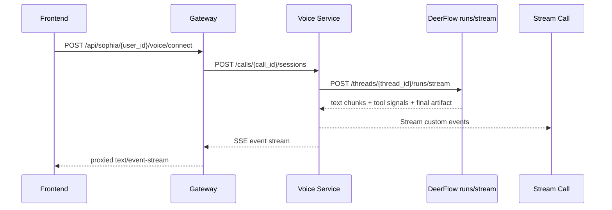

# Bridge Browser-Facing SSE for Live Voice

## Overview

Expose a browser-facing SSE stream for Sophia live voice without changing ownership of the current live voice loop.

The voice service must remain the owner of:

- STT
- the `runs/stream` call
- authoritative final artifact resolution
- TTS
- live event emission

The new backend work should only mirror the live events that already exist into an SSE transport so the frontend can migrate incrementally without breaking the current voice session behavior.

## Problem Frame

SSE already exists in the system, but not as a browser-facing voice endpoint.

The real SSE contract that exists today is:

- `POST /threads/{thread_id}/runs/stream`

That stream is consumed internally by the voice service, not by the browser.

Today, the browser voice client depends on Stream custom events emitted by the voice service, primarily:

- `sophia.user_transcript`
- `sophia.turn`
- `sophia.transcript`
- `sophia.artifact`

That is why a frontend-only migration to SSE is not safe with the current architecture:

- it would duplicate live turn ownership
- it could produce double responses
- it would force the frontend to assume responsibilities that still belong to backend
- it would not solve the real TTS path, which still lives in the voice service

## Requirements Trace

- R1. Keep the voice service as the single owner of the live turn loop.
- R2. Expose a browser-facing SSE stream for live voice events.
- R3. Preserve the current live event contract: `sophia.user_transcript`, `sophia.turn`, `sophia.transcript`, `sophia.artifact`.
- R4. Keep audio on Stream WebRTC; do not move STT or TTS into the frontend.
- R5. Preserve `POST /api/sophia/{user_id}/voice/connect` and `POST /api/sophia/{user_id}/voice/disconnect` as the lifecycle contract.
- R6. Allow the frontend to migrate to SSE without breaking current custom event consumers.
- R7. Clean up SSE subscribers on disconnect, timeout, or agent shutdown.
- R8. Add integration coverage for ordering, cleanup, and gateway proxying.

## Scope Boundaries

In scope:

- a per-session live event bus in the voice service
- a browser-facing SSE endpoint in the voice service
- an SSE proxy endpoint in the gateway
- transport and cleanup tests

Out of scope:

- a large frontend voice refactor
- moving TTS ownership into the browser
- direct browser calls to `runs/stream`
- changing the artifact schema
- replacing Stream WebRTC
- redesigning the shared voice runtime

## Current State

### Gateway

`backend/app/gateway/routers/voice.py` currently exposes only:

- `POST /api/sophia/{user_id}/voice/connect`
- `POST /api/sophia/{user_id}/voice/disconnect`

There is no browser-facing voice SSE route there today.

### Voice Service

`voice/server.py` creates live voice sessions and starts the agent.

`voice/adapters/deerflow.py` consumes:

- `POST /threads/{thread_id}/runs/stream`

`voice/sophia_llm.py` already produces the live events the frontend needs.

### Frontend

The current live voice frontend listens to Stream custom events, not SSE.

That means the live contract already exists in event names and payload shape, but not yet as a browser-facing SSE stream.

## Key Technical Decisions

### 1. Dual delivery during migration

The backend should fan out the same live event into:

- Stream custom events
- the new SSE bus

The current custom event path must not be removed in this phase.

### 2. Preserve the current event schema

The SSE payload should reuse the same logical shape the frontend already consumes:

- `type`
- `data`

Example:

```json
{"type":"sophia.transcript","data":{"text":"...","turn_id":"..."}}
```

If the team also wants to include `event: sophia.transcript`, that is fine, but the authoritative contract should remain the JSON `type/data` envelope.

### 3. Do not change session lifecycle

The frontend should continue bootstrapping voice by calling:

- `POST /voice/connect`

That connect call should continue returning:

- `call_id`
- `session_id`

The frontend can then open the SSE stream using those same identifiers.

### 4. Keep the gateway as the browser-facing API surface

The voice service should not need to be exposed directly to the browser when the Sophia gateway already owns public session APIs.

## High-Level Technical Design



## Implementation Units

### Unit 1. Add a per-session live event bus in the voice service

Introduce an in-memory publisher-subscriber bus keyed at minimum by:

- `session_id`
- `call_id`

That bus should carry already-normalized live events, not raw DeerFlow chunks.

Responsibilities:

- allow one or more SSE subscribers per session
- publish live events as `SophiaLLM` emits them
- close cleanly when the session ends

### Unit 2. Fan out the existing live event contract

At the point where `voice/sophia_llm.py` emits:

- `sophia.user_transcript`
- `sophia.turn`
- `sophia.transcript`
- `sophia.artifact`
- optionally `sophia.turn_diagnostic`

publish the exact same payload into the SSE bus.

Important:

- do not change event names
- do not change payload shape
- do not remove the current Stream custom event emission

The goal is full compatibility during migration.

### Unit 3. Expose an SSE endpoint in the voice service

Add a browser-consumable route in the voice service:

- `GET /calls/{call_id}/sessions/{session_id}/events`

Requirements:

- `Content-Type: text/event-stream`
- `Cache-Control: no-cache`
- no buffering
- periodic heartbeat frames
- clean shutdown when the session ends or the client disconnects
- validate that the `call_id/session_id` pair exists before subscribing

Suggested frame format:

```text
event: sophia.transcript
data: {"type":"sophia.transcript","data":{...}}
```

The `event:` line can be optional.
The important contract is the `type/data` JSON payload.

### Unit 4. Add an SSE proxy in the gateway

Add a new route in `backend/app/gateway/routers/voice.py`:

- `GET /api/sophia/{user_id}/voice/events?call_id=...&session_id=...`

Responsibilities:

- forward the request to the voice service SSE endpoint
- preserve `text/event-stream`
- disable buffering
- propagate client disconnect so upstream listeners are released
- keep Sophia's public API surface consistent

This should be the endpoint used by the frontend.

### Unit 5. Keep the startup contract unchanged

Do not change:

- `POST /api/sophia/{user_id}/voice/connect`
- `POST /api/sophia/{user_id}/voice/disconnect`

New frontend flow after this backend work lands:

1. Call `connect`.
2. Receive `call_id` and `session_id`.
3. Join the Stream call as today.
4. Open the SSE stream with those same IDs.
5. Consume live voice events from SSE instead of Stream custom events.

### Unit 6. Harden lifecycle cleanup

The backend must remove SSE subscribers when:

- the browser disconnects
- `voice/disconnect` is called
- the session expires by timeout
- the agent shuts down or crashes
- the upstream voice session no longer exists

This is mandatory to avoid:

- orphan listeners
- long-lived in-memory queues with no consumer
- memory growth after completed sessions

### Unit 7. Add tests

#### Voice service tests

Add coverage for:

- publishing all supported live events into the SSE bus
- correct ordering for a normal turn
- stream shutdown when the session ends
- cleanup after disconnect
- correct behavior when the session does not exist

#### Gateway tests

Add coverage for:

- SSE proxying without buffering
- payload preservation
- upstream shutdown when the client disconnects
- correct pass-through of streaming headers

## Affected Files

Most likely implementation files:

- `voice/server.py`
- `voice/sophia_llm.py`
- `backend/app/gateway/routers/voice.py`

Most likely test files:

- `voice/tests/...`
- `backend/tests/test_voice_gateway.py`
- related backend streaming tests under `backend/tests/`

## Validation

Expected outcome after backend delivers this work:

1. The frontend can receive via SSE:
   - `sophia.user_transcript`
   - `sophia.turn`
   - `sophia.transcript`
   - `sophia.artifact`
2. The current Stream custom event path keeps working while the frontend migrates.
3. Voice audio behavior does not change because:
   - Stream WebRTC stays in place
   - STT stays in place
   - TTS stays in place
   - the voice service remains the owner of the loop
4. The frontend can later disable custom-event consumption without touching:
   - DeerFlow
   - Cartesia
   - `runs/stream`
   - turn ownership

## Risks

- The main risk is lifecycle cleanup, not product logic.
- If SSE subscribers are not released correctly, the system will accumulate orphan listeners and queues.
- If the SSE payload deviates from the current custom event shape, the frontend migration becomes larger than necessary.
- If the gateway buffers the stream, the SSE channel loses its live-update value.

## Recommendation

Implement a backend-side SSE bridge, not a frontend-owned live voice loop.

This is the smallest change that:

- makes browser SSE viable
- preserves the current architecture
- avoids duplicate responses
- does not require an STT/TTS redesign
- allows gradual frontend migration